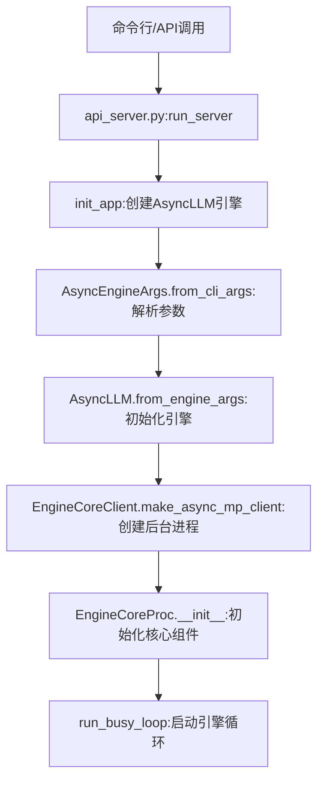
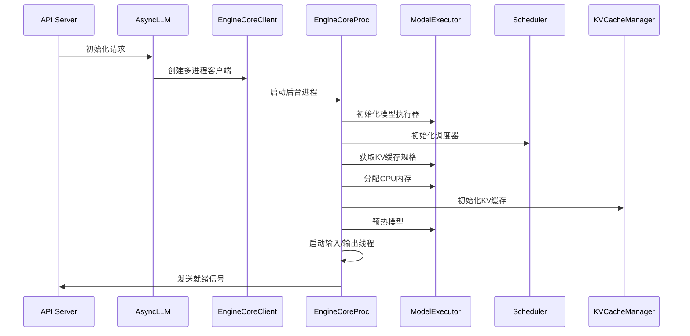
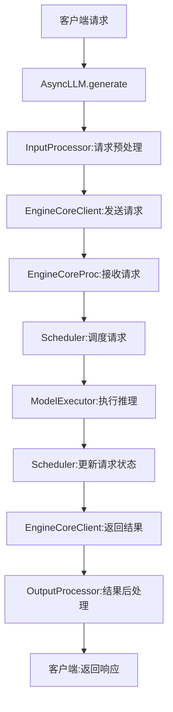
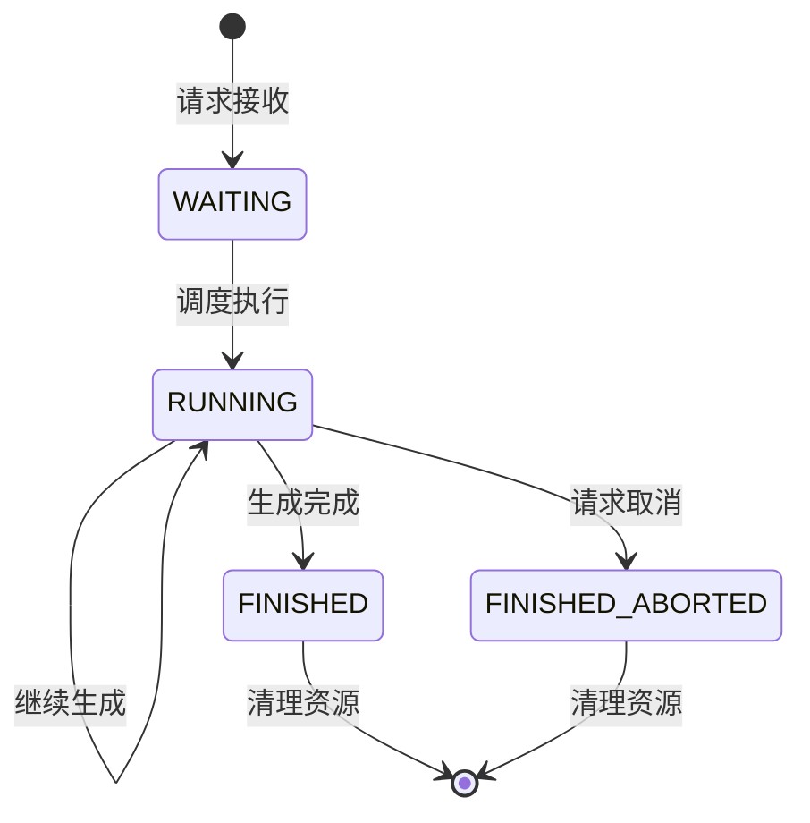

# vLLM 启动过程与请求处理流程分析

## 1. vLLM 启动过程分析

### 1.1 启动入口与初始化链

vLLM的启动过程始于命令行或API调用，主要通过以下路径初始化：



### 1.2 详细启动步骤

#### 1.2.1 参数解析与环境准备
- **文件位置**：`vllm/entrypoints/api_server.py`
- **关键步骤**：
  - 解析命令行参数：`AsyncEngineArgs.add_cli_args(parser)`
  - 设置系统资源限制：`set_ulimit()`
  - 初始化日志系统：`init_logger()`

#### 1.2.2 AsyncLLM引擎初始化
- **文件位置**：`vllm/v1/engine/async_llm.py`
- **关键步骤**：
  - 注册配置序列化器：`maybe_register_config_serialize_by_value()`
  - 初始化tokenizer：`cached_tokenizer_from_config()`
  - 创建输入处理器：`InputProcessor()`
  - 创建输出处理器：`OutputProcessor()`
  - **核心操作**：创建EngineCoreClient（`EngineCoreClient.make_async_mp_client()`）

#### 1.2.3 EngineCore进程启动
- **文件位置**：`vllm/v1/engine/core_client.py`和`vllm/v1/engine/core.py`
- **关键步骤**：
  - 根据数据并行配置选择客户端类型（AsyncMPClient/DPAsyncMPClient/DPLBAsyncMPClient）
  - 在后台进程中启动EngineCore：`run_engine_core()`

#### 1.2.4 EngineCore核心初始化
- **文件位置**：`vllm/v1/engine/core.py` - EngineCoreProc.__init__
- **关键步骤**：
  - 设置信号处理器（SIGTERM/SIGINT）
  - 初始化数据并行环境：`_init_data_parallel()`
  - **父类EngineCore初始化**：
    - 创建模型执行器：`ModelExecutor`
    - 创建调度器：`Scheduler`
    - 初始化KV缓存：`_initialize_kv_caches()`
    - 初始化结构化输出管理器：`StructuredOutputManager`
  - 创建输入输出线程：
    - 输入线程：`process_input_sockets()`
    - 输出线程：`process_output_sockets()`

#### 1.2.5 就绪状态检查
- **文件位置**：`vllm/v1/engine/core.py` - EngineCoreProc.process_input_sockets
- **关键步骤**：
  - 初始化ZMQ输入套接字
  - 如果有协调器，等待来自DP Coordinator的READY消息
  - 设置ready_event，表示引擎已准备就绪

### 1.3 核心组件初始化顺序



### 1.4 启动过程关键技术点

1. **多进程架构**：
   - EngineCore在独立进程中运行，通过ZMQ与前端通信
   - 支持数据并行（DP）模式，通过torch.distributed通信

2. **资源管理**：
   - 动态分配GPU内存用于KV缓存
   - 通过性能分析确定可用内存大小
   - 支持CPU offloading和量化

3. **并行初始化**：
   - 输入/输出处理与GPU计算重叠
   - 模型预热确保首次请求延迟最低

## 2. vLLM 请求处理流程分析

### 2.1 请求处理架构概述



### 2.2 详细请求处理步骤

#### 2.2.1 请求接收与预处理
- **文件位置**：`vllm/v1/engine/async_llm.py` - AsyncLLM.generate
- **关键步骤**：
  - 验证请求参数
  - 初始化输出处理器
  - 预处理输入：
    - 分词（如果需要）
    - 构建EngineCoreRequest
  - 添加请求到引擎：`self.engine_core.add_request_async(request)`

#### 2.2.2 请求调度与执行
- **文件位置**：`vllm/v1/engine/core.py` - EngineCoreProc._process_input_queue
- **关键步骤**：
  - 接收请求：`_handle_client_request()`
  - 预处理请求：`preprocess_add_request()`
  - 添加到调度器：`self.scheduler.add_request(req)`

#### 2.2.3 引擎核心循环
- **文件位置**：`vllm/v1/engine/core.py` - EngineCoreProc.run_busy_loop
- **关键步骤**：
  ```python
  while True:
      # 1. 处理输入队列
      self._process_input_queue()
      # 2. 执行引擎步骤
      self._process_engine_step()
  ```

#### 2.2.4 请求调度与模型执行
- **文件位置**：`vllm/v1/engine/core.py` - EngineCore.step
- **关键步骤**：
  - 调度请求：`scheduler_output = self.scheduler.schedule()`
  - 执行模型：`model_output = self.model_executor.execute_model()`
  - 采样 tokens：`model_output = self.model_executor.sample_tokens()`
  - 更新请求状态：`engine_core_outputs = self.scheduler.update_from_output()`

#### 2.2.5 结果返回与后处理
- **文件位置**：`vllm/v1/engine/core.py` - EngineCoreProc.process_output_sockets
- **关键步骤**：
  - 将结果放入输出队列：`self.output_queue.put_nowait(output)`
  - 通过ZMQ发送结果到前端
  - 后处理：`self.output_processor.process()`
  - 返回给客户端：通过AsyncGenerator流式返回

### 2.3 请求生命周期状态转换



### 2.4 请求处理关键技术点

1. **连续批处理（Continuous Batching）**：
   - 动态合并多个请求到一个批处理
   - 提高GPU利用率

2. **KV缓存管理**：
   - 块级缓存分配
   - 前缀缓存共享
   - 缓存回收策略

3. **调度策略**：
   - 支持FCFS（First-Come, First-Served）
   - 支持基于优先级的调度
   - 支持异步调度模式

4. **异步处理**：
   - 全异步设计，提高并发性能
   - 通过AsyncGenerator流式返回结果

## 3. 核心组件交互图

```mermaid
flowchart LR
    subgraph 前端进程
        A[AsyncLLM] --> B[EngineCoreClient]
        B --> C[InputProcessor]
        B --> D[OutputProcessor]
    end
    
    subgraph 后台进程
        E[EngineCoreProc] --> F[ModelExecutor]
        E --> G[Scheduler]
        E --> H[KVCacheManager]
        E --> I[StructuredOutputManager]
        F --> G
        G --> H
    end
    
    B <==> E: ZMQ通信
```

## 4. 性能优化关键点

### 4.1 启动性能优化
- **预热模型**：在启动时预热模型，减少首次请求延迟
- **内存预分配**：提前分配KV缓存内存
- **并行初始化**：输入/输出线程与GPU计算重叠

### 4.2 请求处理性能优化
- **连续批处理**：最大化GPU利用率
- **KV缓存共享**：减少重复计算
- **异步调度**：提高并发处理能力
- **高效通信**：使用ZMQ进行进程间通信，减少延迟

## 5. 总结

vLLM的启动过程和请求处理流程设计体现了现代高性能AI推理系统的关键特性：

1. **分层架构**：清晰的前后端分离设计，提高可维护性和扩展性
2. **多进程设计**：隔离计算密集型任务，提高系统稳定性
3. **动态资源管理**：智能分配GPU内存，支持大规模模型
4. **高效调度**：连续批处理和智能调度策略，最大化硬件利用率
5. **异步设计**：全异步处理流程，提高并发性能

这些设计使得vLLM能够在保持低延迟的同时，实现高吞吐量的LLM推理服务。