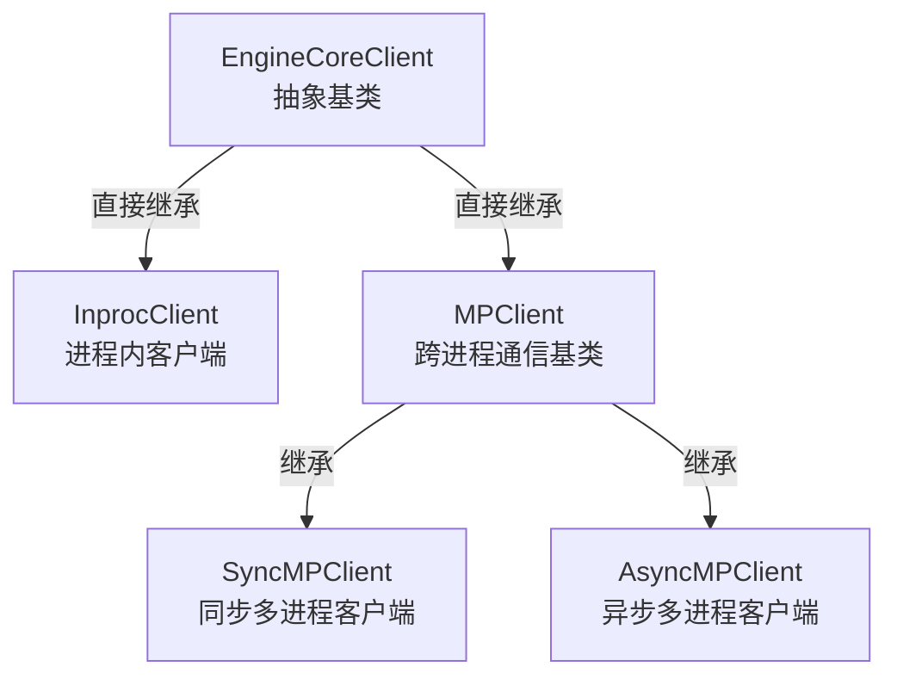
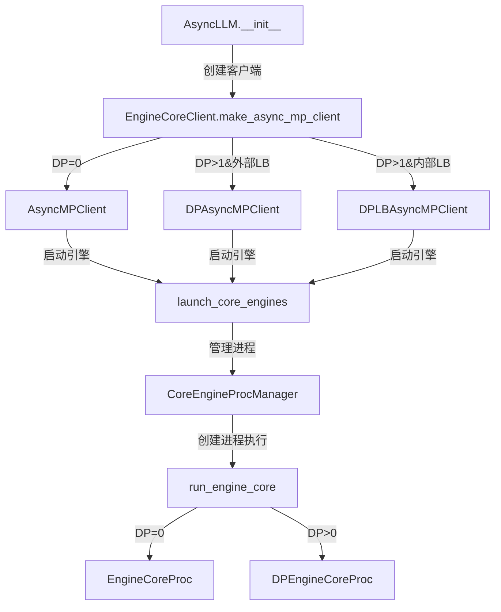

# vLLM 架构设计分析

## 1. 核心组件概述

vLLM由多个核心组件构成，它们共同协作实现高效的模型推理：

### 1.1 入口层
- **功能**：处理客户端API请求的入口点，负责启动服务器、初始化引擎和处理HTTP请求。
- **核心函数**：`run_server` - 服务器启动和初始化的主函数。
- **文件位置**：`vllm/entrypoints/api_server.py`

### 1.2 前端引擎层
- **功能**：作为用户与系统交互的接口层，负责请求的接收、预处理、结果后处理和响应返回。
- **核心组件**：`AsyncLLM` - 异步引擎接口
- **核心函数**：`generate` - 处理生成请求的入口；`add_request` - 转换请求并发送到核心进程。
- **文件位置**：`vllm/v1/engine/async_llm.py`

### 1.3 通信层
- **功能**：实现前端进程（P0）和核心进程（P1）之间的通信。
- **核心组件**：`EngineCoreClient` - 通信客户端抽象
- **技术**：使用ZeroMQ (ZMQ) 进行跨进程通信，Msgpack进行数据序列化。
- **文件位置**：`vllm/v1/engine/core_client.py`

### 1.4 核心引擎层
- **功能**：vLLM的核心处理单元，负责请求调度、模型推理、资源管理和结果生成。
- **核心组件**：`EngineCore` - 核心引擎实现
- **关键组件**：
  - 调度器：管理请求队列和执行顺序
  - 模型执行器：执行实际的模型推理
  - KV缓存管理器：管理键值缓存以提高性能
- **文件位置**：`vllm/v1/engine/core.py`

### 1.5 调度器
- **功能**：管理请求的执行顺序、分配资源和决定哪些请求可以同时运行。
- **核心函数**：`schedule` - 根据优先级和资源限制调度请求。
- **文件位置**：`vllm/v1/scheduler/`

### 1.6 模型执行器
- **功能**：负责实际的模型推理计算，执行token生成和采样。
- **核心函数**：`step` - 执行引擎步骤，包括调度和模型推理。
- **文件位置**：`vllm/v1/model_executor/`

### 1.7 KV缓存管理器
- **功能**：高效管理注意力机制的键值缓存，包括块分配、前缀缓存和缓存共享。
- **关键技术**：PagedAttention算法，实现高效的内存管理。
- **文件位置**：`vllm/v1/attention/`

### 1.8 模型运行器
- **功能**：执行实际的模型推理计算，是vLLM的底层计算引擎。
- **核心组件**：`GPUModelRunner`、`TPUModelRunner`等针对不同硬件的实现
- **技术**：支持GPU、TPU等硬件加速，实现高效的模型前向传播和token采样。
- **关键功能**：
  - 模型权重加载和管理
  - 前向传播计算
  - token采样和生成
  - 硬件资源管理
- **文件位置**：`vllm/v1/worker/gpu_model_runner.py`、`vllm/v1/worker/tpu_model_runner.py`等

<!-- ## 2. 核心组件调用链分析

### 2.1 EngineCore → ModelExecutor → Worker → ModelRunner调用链概述

vLLM的核心推理流程由一条清晰的调用链构成，从用户请求到最终的模型计算，每个组件都承担着特定的职责：

```
EngineCore → ModelExecutor → Worker → ModelRunner
```

### 2.2 调用链各组件详解

#### 2.2.1 EngineCore
- **功能定位**：vLLM的核心引擎，负责请求调度、资源管理和模型推理的整体协调。
- **初始化过程**：
  ```python
  # 由EngineCoreProc或DPEngineCoreProc初始化
  def __init__(self, vllm_config: VllmConfig, ...):
      # 初始化调度器
      self.scheduler = Scheduler(...)
      # 初始化模型执行器
      self.model_executor = ModelExecutor(...)
      # 初始化KV缓存管理器
      self.kv_cache_manager = KVCacheManager(...)
  ```
- **调用ModelExecutor的方式**：
  ```python
  # 步骤1：调度请求
  scheduler_output = self.scheduler.schedule()
  # 步骤2：执行模型计算
  future = self.model_executor.execute_model(scheduler_output, non_block=True)
  # 步骤3：获取结果
  model_output = future.result()
  ```
- **文件位置**：`vllm/v1/engine/core.py`

#### 2.2.2 ModelExecutor
- **功能定位**：作为EngineCore和Worker之间的中间层，负责任务分配和多进程管理。
- **初始化过程**：
  - 由EngineCore初始化时创建
  - 根据配置选择合适的执行器类型（如MultiprocExecutor）
- **核心职责**：
  - 管理Worker进程池
  - 将EngineCore的请求分配给合适的Worker
  - 处理Worker之间的通信和结果汇总
- **调用Worker的方式**：
  - 支持同步和异步调用
  - 根据任务类型和负载情况选择最佳的Worker
- **文件位置**：`vllm/v1/executor/multiproc_executor.py`

#### 2.2.3 Worker
- **功能定位**：具体执行模型计算任务的工作进程，负责与ModelRunner交互。
- **初始化过程**：
  ```python
  def __init__(self, vllm_config: VllmConfig, ...):
      # 初始化设备和资源
      self.device = ...
      # 创建ModelRunner实例
      if self.use_v2_model_runner:
          self.model_runner = GPUModelRunnerV2(self.vllm_config, self.device)
      else:
          self.model_runner = GPUModelRunnerV1(self.vllm_config, self.device)
      # 加载模型权重
      self.model_runner.load_model()
  ```
- **核心职责**：
  - 预处理输入数据
  - 调用ModelRunner执行模型计算
  - 后处理输出结果
- **调用ModelRunner的方式**：
  ```python
  def execute_model(self, scheduler_output: "SchedulerOutput") -> ModelRunnerOutput | None:
      # 预处理和准备工作
      with self.annotate_profile(scheduler_output):
          # 调用ModelRunner执行模型计算
          output = self.model_runner.execute_model(scheduler_output, intermediate_tensors)
      return output
  ```
- **文件位置**：`vllm/v1/worker/gpu_worker.py`

#### 2.2.4 ModelRunner
- **功能定位**：vLLM的底层计算引擎，直接与硬件交互执行模型推理。
- **初始化过程**：
  ```python
  def __init__(self, vllm_config: VllmConfig, device: str):
      # 从配置获取模型信息
      self.model_name = vllm_config.model_config.model_name_or_path
      self.tokenizer_name = vllm_config.model_config.tokenizer
      # 初始化硬件资源
      self.device = device
  ```
- **核心职责**：
  - 模型权重加载和管理
  - 前向传播计算
  - token采样和生成
  - 硬件资源优化
- **执行模型计算的方式**：
  ```python
  def execute_model(self, scheduler_output: "SchedulerOutput", ...) -> ModelRunnerOutput | None:
      # 执行前向传播计算
      logits = self.forward(scheduler_output)
      # 生成token
      output = self.sample_tokens(logits)
      return output
  ```
- **文件位置**：`vllm/v1/worker/gpu_model_runner.py`（GPU）、`vllm/v1/worker/tpu_model_runner.py`（TPU）等


### 2.4 调用链的技术特点

1. **职责分离**：每个组件专注于单一职责，提高代码的可维护性和可扩展性
2. **异步支持**：支持异步调用模式，提高系统吞吐量
3. **多进程架构**：将计算密集型任务与前端通信分离，提高系统稳定性
4. **硬件抽象**：通过ModelRunner层实现硬件抽象，支持多种硬件平台
5. **灵活配置**：支持根据需求配置不同的组件实现 -->

## 2. 从外往里：vLLM架构层次分析

### 2.1 第一层：用户接口层（P0进程）

#### 2.1.1 P0进程的定位与职责

**P0进程是vLLM的"门面"**，直接面向用户，负责处理所有外部交互：
- **HTTP/API接口**：提供OpenAI兼容的RESTful API
- **请求接收与验证**：处理用户输入，验证参数合法性
- **结果格式化**：将模型输出转换为用户友好的格式
- **流式输出支持**：实现实时生成结果的流式返回

**设计目标**：将I/O密集型任务与计算密集型任务分离，提高系统稳定性

#### 2.1.2 P0核心组件：用户交互三剑客

##### AsyncLLM引擎接口
- **文件位置**：`vllm/v1/engine/async_llm.py`
- **核心功能**：
  - 统一异步接口：为上层应用提供一致的API
  - 请求生命周期管理：从接收到返回的全流程控制
  - 组件协调：整合InputProcessor和OutputProcessor

**关键方法**：
```python
async def generate(
    self,
    prompt: EngineCoreRequest | PromptType,
    sampling_params: SamplingParams,
    request_id: str,
    # ... 其他参数
) -> AsyncGenerator[RequestOutput, None]:
    # 1. 参数验证
    # 2. 启动输出处理器
    # 3. 添加请求到引擎
    # 4. 流式返回结果
```

##### InputProcessor输入处理器
- **文件位置**：`vllm/v1/engine/input_processor.py`
- **核心功能**：
  - **参数验证**：检查logprobs、allowed_token_ids等参数
  - **多模态处理**：支持图像、视频等非文本输入
  - **文本预处理**：与Tokenizer交互，转换输入格式

**处理流程**：
```
用户输入 → 参数验证 → 多模态处理 → Tokenizer转换 → EngineCoreRequest
```

##### OutputProcessor输出处理器
- **文件位置**：`vllm/v1/engine/output_processor.py`
- **核心功能**：
  - **状态管理**：跟踪请求运行状态（运行中/已完成/已中止）
  - **流式输出**：管理实时生成结果的缓冲区
  - **格式转换**：将模型输出转换为API响应格式

#### 2.1.3 P0进程启动流程

P0进程由`run_server`函数启动，流程如下：
```python
def run_server(vllm_config: VllmConfig, ...):
    # 1. 初始化前端组件
    async_llm = AsyncLLM(vllm_config, ...)
    
    # 2. 启动通信客户端
    engine_core = EngineCoreClient.make_async_mp_client(vllm_config, ...)
    
    # 3. 启动HTTP服务器
    app = create_app(async_llm, ...)
    uvicorn.run(app, ...)
```

### 2.2 第二层：通信桥梁层（EngineCoreClient）

#### 2.2.1 EngineCoreClient的角色

**EngineCoreClient是P0与P1之间的"信使"**，负责：
- **请求转发**：将P0处理后的请求发送给P1
- **结果返回**：接收P1的推理结果并返回给P0
- **通信管理**：维护稳定的进程间通信通道

**设计目标**：实现高效、可靠的跨进程通信，隔离前端与核心

#### 2.2.2 通信机制详解

**请求发送路径**：
```
AsyncLLM → EngineCoreClient → ZeroMQ → EngineCoreProc → EngineCore
```

**结果返回路径**：
```
EngineCore → EngineCoreProc → ZeroMQ → EngineCoreClient → AsyncLLM
```

**技术选型**：
- **ZeroMQ**：高性能消息队列，支持零拷贝传输
- **Msgpack**：高效的二进制序列化，低CPU开销
- **异步通信**：基于asyncio，支持高并发

**详细分析**：见第4章 EngineCoreClient继承关系与功能分析

### 2.3 第三层：核心计算层（P1进程）

#### 2.3.1 P1进程的定位与职责

**P1进程是vLLM的"计算引擎"**，专注于高性能模型推理：
- **模型推理**：执行LLM的前向传播计算
- **资源管理**：管理GPU内存、KV缓存等关键资源
- **请求调度**：决定请求执行顺序和并行策略
- **性能优化**：实现PagedAttention等先进算法

**设计目标**：专注于计算密集型任务，不受前端I/O影响

#### 2.3.2 P1核心组件：计算引擎四核心

##### EngineCore核心引擎
- **文件位置**：`vllm/v1/engine/core.py`
- **核心功能**：
  - **组件协调**：整合调度器、模型执行器、KV缓存管理器
  - **生命周期管理**：控制请求从接收到完成的完整流程
  - **通信处理**：接收P0请求，返回推理结果

**核心循环**：
```python
def run_busy_loop(self):
    """核心忙碌循环"""
    while True:
        # 1. 处理输入队列
        self._process_input_queue()
        
        # 2. 执行引擎步骤
        self._process_engine_step()
        
        # 3. 检查停止条件
        if self._should_stop:
            break
```

##### Scheduler调度器
- **文件位置**：`vllm/v1/scheduler/`
- **核心功能**：
  - **队列管理**：维护请求等待队列和执行队列
  - **资源分配**：动态分配GPU资源和KV缓存块
  - **调度策略**：实现优先级调度和连续批处理

**调度算法特点**：
- 基于请求优先级和资源可用性
- 支持动态调整并行度
- 优化GPU利用率

##### ModelExecutor模型执行器
- **文件位置**：`vllm/v1/model_executor/`
- **核心功能**：
  - **进程管理**：管理Worker进程池
  - **任务分配**：将计算任务分配给合适的Worker
  - **结果汇总**：收集并整合Worker的计算结果

**执行模式**：
- 多进程执行（MultiprocExecutor）
- 支持负载均衡和故障恢复
- 异步执行提高吞吐量

##### KV缓存管理器
- **文件位置**：`vllm/v1/attention/`
- **核心功能**：
  - **缓存管理**：实现高效的键值缓存分配和回收
  - **算法优化**：PagedAttention算法，减少内存碎片
  - **性能优化**：前缀缓存共享，提高缓存命中率

**关键技术**：
- 分页KV缓存管理
- 内存碎片整理
- 缓存预分配策略

#### 2.3.3 P1进程启动流程

P1进程由`run_engine_core`函数启动：
```python
def run_engine_core(*args, dp_rank: int = 0, local_dp_rank: int = 0, **kwargs):
    # 根据数据并行配置选择引擎类型
    if parallel_config.data_parallel_size > 1 or dp_rank > 0:
        engine_core = DPEngineCoreProc(*args, **kwargs)  # 分布式引擎
    else:
        engine_core = EngineCoreProc(*args, **kwargs)  # 普通引擎
    
    # 启动核心忙碌循环
    engine_core.run_busy_loop()
```

### 2.4 架构层次总结

#### 2.4.2 数据流全景图

```
用户请求 → P0(AsyncLLM/InputProcessor) → 通信层(EngineCoreClient) → P1(EngineCore)
                                                                 ↓
推理结果 ← P0(OutputProcessor) ← 通信层(EngineCoreClient) ← P1(EngineCore)
```


## 3 EngineCoreClient 继承关系与功能分析

### 3.1 继承关系图



### 3.2 核心类解析

#### 3.2.1 EngineCoreClient（抽象基类）

**定义位置**：`vllm/v1/engine/core_client.py:61`

**核心功能**：
- 定义客户端与引擎核心通信的抽象接口
- 提供客户端创建工厂方法 `make_client()`
- 支持不同通信模式（进程内、同步多进程、异步多进程）

**关键方法**：
- `add_request()`: 添加请求到引擎核心
- `get_output()`: 获取引擎输出
- `abort_requests()`: 中止请求
- `call_utility()`: 调用引擎工具方法

#### 3.2.2 InprocClient（进程内客户端）

**定义位置**：`vllm/v1/engine/core_client.py:257`

**核心功能**：
- 在同一进程内直接与 `EngineCore` 交互
- 无网络通信开销，适用于单进程场景

**实现特点**：
- 内部持有 `EngineCore` 实例
- 直接调用 `EngineCore` 方法，无序列化/反序列化开销
- 用于 V0 风格的 `LLMEngine`

**关键方法**：
```python
def __init__(self, *args, **kwargs):
    self.engine_core = EngineCore(*args, **kwargs)

def add_request(self, request: EngineCoreRequest) -> None:
    req, request_wave = self.engine_core.preprocess_add_request(request)
    self.engine_core.add_request(req, request_wave)
```

#### 3.2.3 MPClient（跨进程通信基类）

**核心功能**：
- 提供跨进程通信的基础实现
- 基于 ZeroMQ (ZMQ) 实现高效的进程间通信
- 使用 Msgpack 进行数据序列化/反序列化

**实现特点**：
- 管理 ZMQ 套接字（输入/输出）
- 处理消息编码/解码
- 支持多进程和分布式场景

#### 3.2.4 SyncMPClient（同步多进程客户端）

**定义位置**：`vllm/v1/engine/core_client.py:642`

**核心功能**：
- 提供同步的跨进程通信接口
- 适用于需要阻塞等待结果的场景

**实现特点**：
- 继承自 `MPClient`
- 使用线程处理异步通信，对外提供同步接口
- 适用于非异步代码环境

#### 3.2.5 AsyncMPClient（异步多进程客户端）

**定义位置**：`vllm/v1/engine/core_client.py:808`

**核心功能**：
- 提供异步的跨进程通信接口
- 适用于高并发、异步代码环境

**实现特点**：
- 继承自 `MPClient`
- 基于 `asyncio` 实现异步通信
- 使用异步队列管理输出
- 支持并行处理多个请求

**关键方法**：
```python
async def get_output_async(self) -> EngineCoreOutputs:
    self._ensure_output_queue_task()
    outputs = await self.outputs_queue.get()
    if isinstance(outputs, Exception):
        raise self._format_exception(outputs) from None
    return outputs

async def add_request_async(self, request: EngineCoreRequest) -> None:
    request.client_index = self.client_index
    await self._send_input(EngineCoreRequestType.ADD, request)
    self._ensure_output_queue_task()
```

### 3.3 各客户端类的应用场景

| 客户端类 | 应用场景 | 优点 | 缺点 |
|----------|----------|------|------|
| InprocClient | 单进程环境、调试、测试 | 无通信开销、简单直接 | 无法利用多进程优势 |
| SyncMPClient | 同步代码环境、兼容性要求高 | 接口简单、易集成 | 阻塞等待降低并发 |
| AsyncMPClient | 高并发异步环境、生产环境 | 高性能、非阻塞 | 需要异步代码支持 |

### 3.4 客户端创建机制

`EngineCoreClient` 提供工厂方法 `make_client()` 根据配置创建不同类型的客户端：

```python
@staticmethod
def make_client(
    multiprocess_mode: bool,
    asyncio_mode: bool,
    vllm_config: VllmConfig,
    executor_class: type[Executor],
    log_stats: bool,
) -> "EngineCoreClient":
    if asyncio_mode and not multiprocess_mode:
        raise NotImplementedError(
            "Running EngineCore in asyncio without multiprocessing "
            "is not currently supported."
        )

    if multiprocess_mode and asyncio_mode:
        return AsyncMPClient(vllm_config, executor_class, log_stats)

    if multiprocess_mode and not asyncio_mode:
        return SyncMPClient(vllm_config, executor_class, log_stats)

    return InprocClient(vllm_config, executor_class, log_stats)
```

## 4. 数据并行(DP)架构与初始化分离分析

### 4.1 核心对比表格

| 对比维度 | 禁用DP | 启用DP |
|----------|--------|--------|
| **进程结构** | 1个EngineCore进程 | 多个EngineCore进程（1个/DP rank） |
| **引擎类型** | `EngineCoreProc` | `DPEngineCoreProc` |
| **协调器** | 无 | 有`DPCoordinator`进程 |
| **GPU数量** | 1个 | 多个（1个/DP rank） |
| **通信架构** | 简单（前端↔EngineCore） | 复杂（前端↔多个EngineCore+EngineCore间通信） |
| **内存分配** | 单GPU内存限制 | 分布式内存（总内存=单GPU×DP数） |
| **计算分布** | 单GPU计算 | 分布式计算 |
| **启动时间** | 较短 | 较长（需分布式初始化） |
| **适用场景** | 小模型、低并发、调试 | 大模型、高并发、生产环境 |
| **复杂度** | 低 | 高（分布式协调+跨进程通信） |
| **吞吐量潜力** | 受单GPU限制 | 可线性扩展（受通信开销影响） |

### 4.2 DP初始化分离的实际起始层级

#### 4.2.1 客户端层面的分离（最早起点）

**关键位置**：`vllm/v1/engine/core_client.py:106-121`（`make_async_mp_client`方法）

**代码证据**：
```python
@staticmethod
def make_async_mp_client(vllm_config: VllmConfig, ...) -> "MPClient":
    parallel_config = vllm_config.parallel_config
    client_args = (...)  # 参数准备
    
    # 根据DP配置选择不同的客户端类
    if parallel_config.data_parallel_size > 1:
        if parallel_config.data_parallel_external_lb:
            return DPAsyncMPClient(*client_args)  # 外部负载均衡DP客户端
        return DPLBAsyncMPClient(*client_args)  # 内部负载均衡DP客户端
    return AsyncMPClient(*client_args)  # 普通客户端
```

#### 4.2.2 引擎层面的分离

**关键位置**：`vllm/v1/engine/core.py:846-857`（`run_engine_core`函数）

**代码证据**：
```python
def run_engine_core(*args, dp_rank: int = 0, local_dp_rank: int = 0, **kwargs):
    parallel_config: ParallelConfig = kwargs["vllm_config"].parallel_config
    
    # 根据DP配置选择不同的引擎类
    if parallel_config.data_parallel_size > 1 or dp_rank > 0:
        engine_core = DPEngineCoreProc(*args, **kwargs)  # 分布式引擎
    else:
        engine_core = EngineCoreProc(*args, **kwargs)  # 普通引擎
    
    engine_core.run_busy_loop()
```

### 4.3 DP初始化分离的完整调用链



### 4.4 DP初始化分离的两个层次

#### 4.4.1 客户端层面的分离
- **目的**：为不同的DP配置提供专门的客户端实现
- **实现**：选择`AsyncMPClient`、`DPAsyncMPClient`或`DPLBAsyncMPClient`
- **影响**：客户端的通信逻辑、负载均衡策略和协调机制不同

#### 4.4.2 引擎层面的分离
- **目的**：为不同的DP配置提供专门的引擎实现
- **实现**：选择`EngineCoreProc`或`DPEngineCoreProc`
- **影响**：引擎的初始化流程、分布式协调和计算策略不同

### 4.5 关键技术细节

1. **客户端分离的依据**：
   - `parallel_config.data_parallel_size > 1` 决定是否使用DP客户端
   - `parallel_config.data_parallel_external_lb` 决定使用哪种DP客户端

2. **引擎分离的依据**：
   - `parallel_config.data_parallel_size > 1` 或 `dp_rank > 0` 决定是否使用DP引擎
   - `DPEngineCoreProc` 继承自 `EngineCoreProc` 并添加了DP特定功能

3. **DP初始化的关键步骤**：
   - 客户端创建阶段：选择合适的客户端类
   - 引擎启动阶段：选择合适的引擎类
   - 引擎初始化阶段：配置分布式进程组和跨GPU通信
