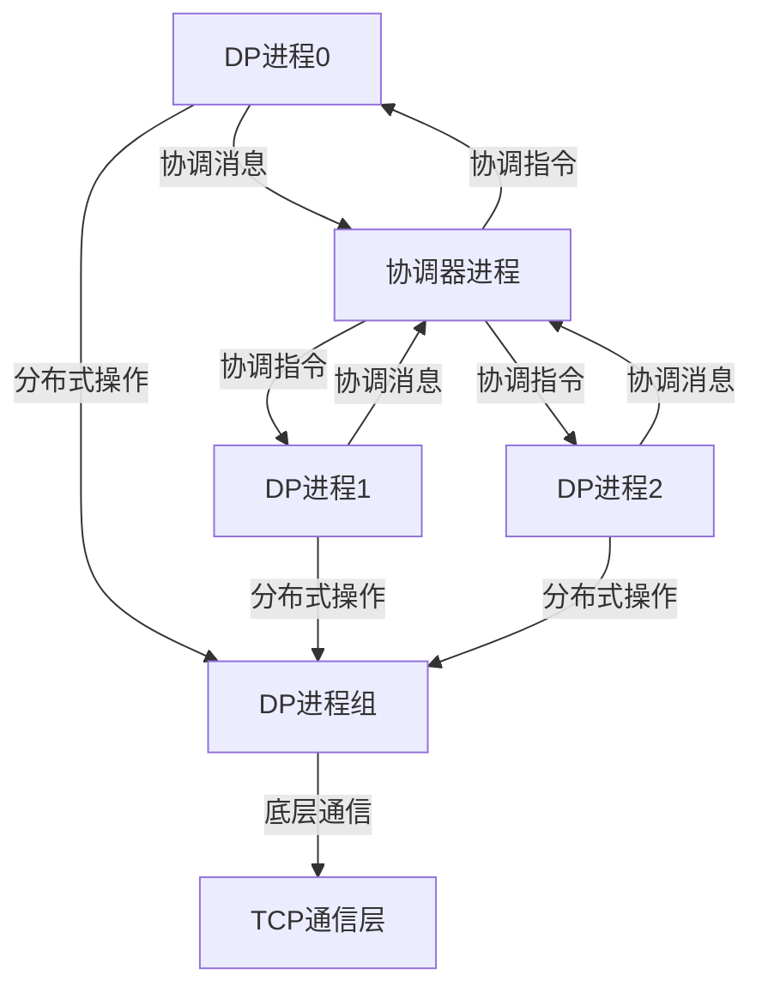
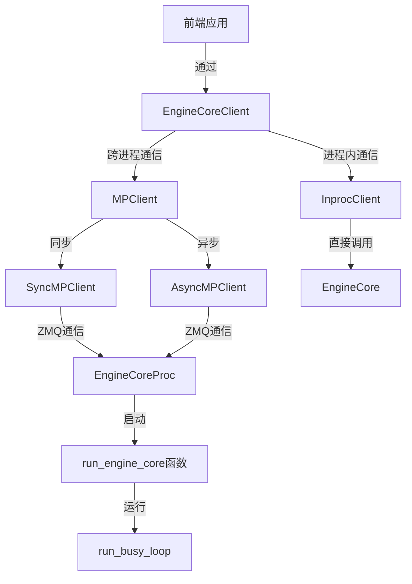
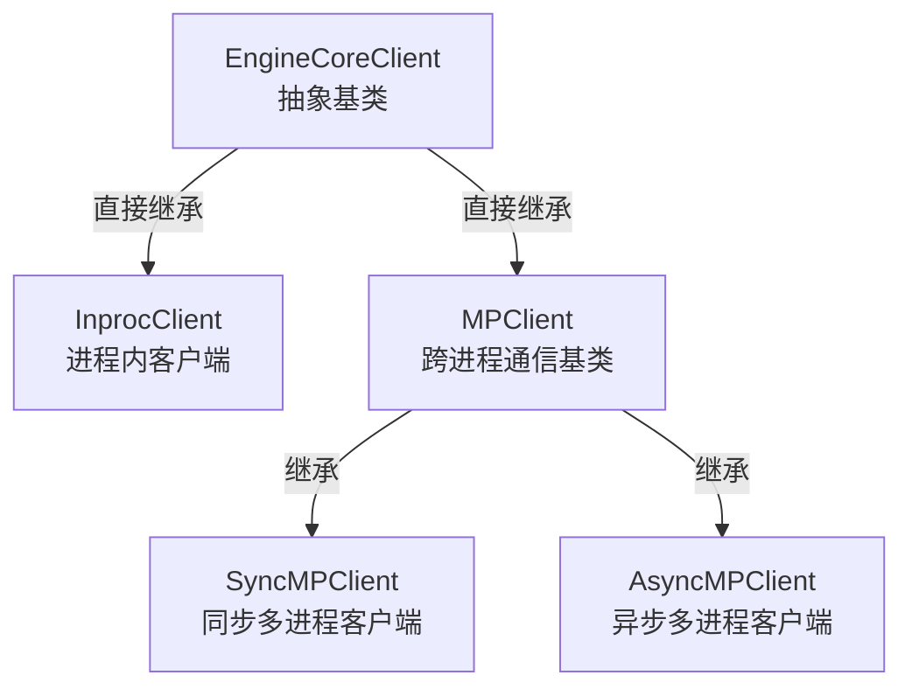
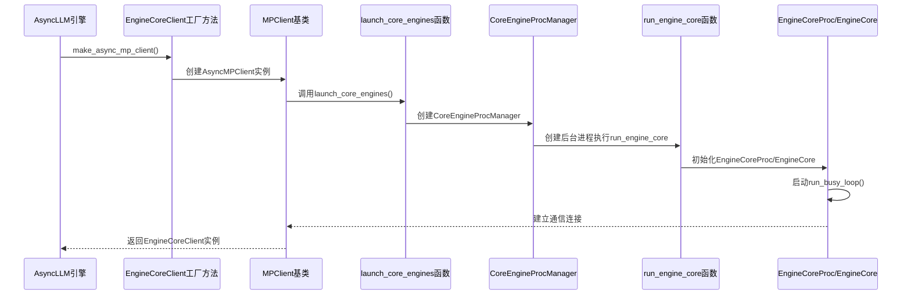
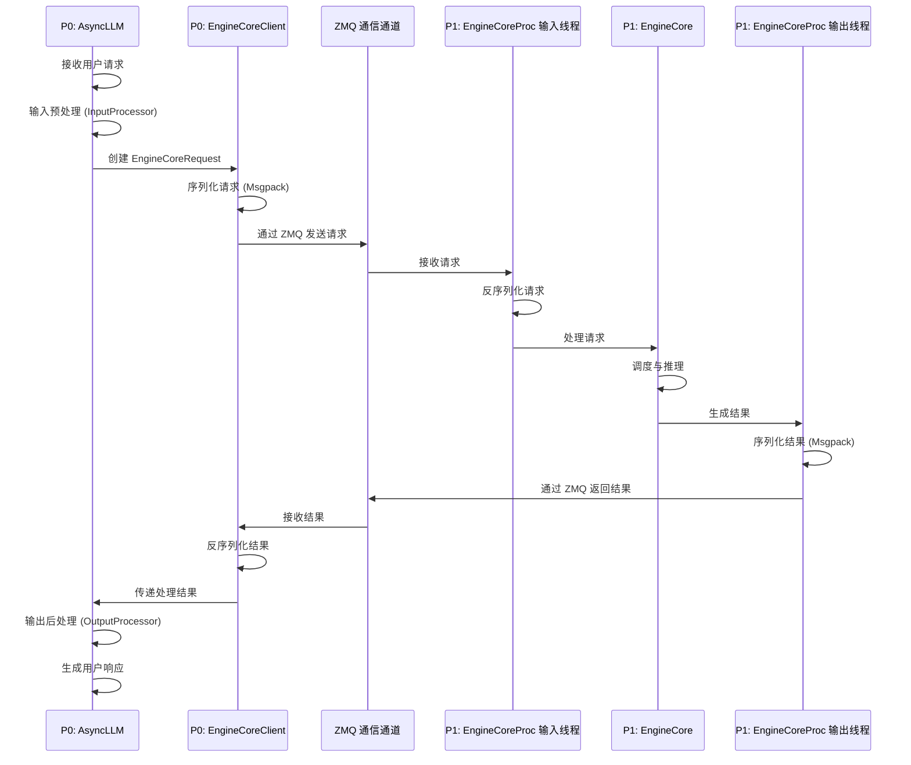
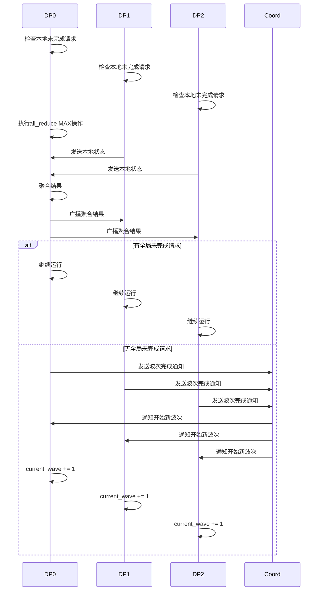

# vLLM数据并行(DP)进程通信机制分析

## 1. 通信架构概述

### 1.1 核心通信组件

| 组件 | 作用 | 实现方式 |
|------|------|----------|
| **DP进程组** | 管理DP进程集合 | `torch.distributed`进程组 |
| **通信后端** | 底层通信协议 | TCP/IP (gloo) |
| **协调器** | 跨进程同步协调 | ZeroMQ通信 |
| **同步原语** | 进程间数据交换 | `all_reduce`等分布式操作 |

### 1.2 通信层次结构



## 2. 通信初始化机制

### 2.1 DP进程组创建

**关键方法**：`ParallelConfig.stateless_init_dp_group()` (`vllm/v1/config/parallel.py:345-373`)

**实现细节**：
```python
def stateless_init_dp_group(self) -> ProcessGroup:
    # 使用无状态进程组避免污染全局状态
    # 支持端口冲突重试机制，提高鲁棒性
    return stateless_init_torch_distributed_process_group(
        self.data_parallel_master_ip,
        self.get_next_dp_init_port(),
        self.data_parallel_rank,
        self.data_parallel_size,
        backend=current_platform.dist_backend,
    )
```

**特点**：
- 使用`stateless_init_torch_distributed_process_group`避免全局状态污染
- 支持端口冲突自动重试（最多5次）
- 默认使用`gloo`后端（CPU通信，避免CUDA依赖）

### 2.2 无状态进程组实现

**关键类**：`StatelessProcessGroup` (`vllm/distributed/utils.py:366-418`)

**设计优势**：
- 不污染全局进程组状态
- 支持动态创建多个独立的进程组
- 使用TCPStore作为通信存储
- 主进程(rank=0)负责监听连接

## 3. 核心通信操作

### 3.1 全局未完成请求同步

**关键方法**：`ParallelConfig.has_unfinished_dp()` (`vllm/v1/config/parallel.py:420-433`)

**实现细节**：
```python
def has_unfinished_dp(dp_group: ProcessGroup, has_unfinished: bool) -> bool:
    tensor = torch.tensor([has_unfinished], dtype=torch.int32, device="cpu")
    # 使用MAX操作实现逻辑OR（只要有一个进程有未完成请求，结果就是True）
    torch.distributed.all_reduce(tensor, op=ReduceOp.MAX, group=dp_group)
    aggregated_has_unfinished = bool(tensor.item())
    return aggregated_has_unfinished
```

## 7. EngineCoreClient与EngineCore通信机制专题

### 7.1 整体架构与交互关系

EngineCoreClient与EngineCore构成了vLLM的核心通信架构，实现了前端与引擎核心的解耦和高效通信。



### 7.2 EngineCoreClient继承体系

#### 7.2.1 继承关系图



#### 7.2.2 核心类功能解析

**EngineCoreClient（抽象基类）**
- **定义位置**：`vllm/v1/engine/core_client.py:61`
- **核心功能**：定义客户端与引擎核心通信的抽象接口，提供工厂方法

**InprocClient（进程内客户端）**
- **适用场景**：单进程环境、调试、测试
- **实现特点**：直接持有EngineCore实例，无通信开销

**MPClient（跨进程通信基类）**
- **通信机制**：基于ZeroMQ实现进程间通信
- **数据序列化**：使用Msgpack进行高效序列化

**SyncMPClient（同步多进程客户端）**
- **适用场景**：同步代码环境、兼容性要求高
- **特点**：使用线程处理异步通信，对外提供同步接口

**AsyncMPClient（异步多进程客户端）**
- **适用场景**：高并发异步环境、生产环境
- **特点**：基于asyncio实现非阻塞通信，支持并行处理

#### 7.2.3 客户端类应用场景对比

| 客户端类 | 应用场景 | 优点 | 缺点 |
|----------|----------|------|------|
| InprocClient | 单进程环境、调试、测试 | 无通信开销、简单直接 | 无法利用多进程优势 |
| SyncMPClient | 同步代码环境、兼容性要求高 | 接口简单、易集成 | 阻塞等待降低并发 |
| AsyncMPClient | 高并发异步环境、生产环境 | 高性能、非阻塞 | 需要异步代码支持 |

### 7.3 自动启动与通信机制

#### 7.3.1 启动流程概述

EngineCoreClient与EngineCore的启动是一个**自动联动**的过程：



#### 7.3.2 关键启动函数

**EngineCoreClient.make_async_mp_client()**
- **位置**：`vllm/v1/engine/core_client.py:98-121`
- **作用**：根据并行配置创建合适的客户端实例

**MPClient.__init__()**
- **位置**：`vllm/v1/engine/core_client.py:442-553`
- **关键步骤**：
  1. 初始化ZMQ上下文和序列化器
  2. **调用`launch_core_engines()`启动EngineCore进程**
  3. 建立ZMQ输入/输出套接字
  4. 等待EngineCore进程的就绪消息

#### 7.3.3 通信建立过程

1. **EngineCoreClient** 初始化ZMQ输入/输出套接字
2. **EngineCore** 启动后初始化自己的ZMQ套接字
3. **EngineCore** 向 **EngineCoreClient** 发送就绪消息
4. **EngineCoreClient** 收到就绪消息后完成初始化
5. 双方建立稳定的ZMQ通信通道

### 7.4 客户端选择策略

#### 7.4.1 工厂方法机制

`EngineCoreClient` 提供工厂方法 `make_client()` 根据配置创建不同类型的客户端：

```python
@staticmethod
def make_client(
    multiprocess_mode: bool,
    asyncio_mode: bool,
    vllm_config: VllmConfig,
    executor_class: type[Executor],
    log_stats: bool,
) -> "EngineCoreClient":
    if asyncio_mode and not multiprocess_mode:
        raise NotImplementedError(
            "Running EngineCore in asyncio without multiprocessing "
            "is not currently supported."
        )

    if multiprocess_mode and asyncio_mode:
        return AsyncMPClient(vllm_config, executor_class, log_stats)

    if multiprocess_mode and not asyncio_mode:
        return SyncMPClient(vllm_config, executor_class, log_stats)

    return InprocClient(vllm_config, executor_class, log_stats)
```

#### 7.4.2 OpenAI API的选择

**结论**：OpenAI API服务器使用的是**异步客户端**。

**选择原因**：
- **高并发性能需求**：异步IO允许在等待IO操作时处理其他请求
- **流式输出支持**：异步生成器天然适合实现流式响应
- **框架兼容性**：FastAPI是异步框架，与异步客户端无缝集成

**代码证据**：
```python
# vllm/entrypoints/openai/api_server.py:146-178
async def build_async_engine_client(
    args: Namespace,
    *,  # 关键字参数
    usage_context: UsageContext = UsageContext.OPENAI_API_SERVER,
    disable_frontend_multiprocessing: bool | None = None,
    client_config: dict[str, Any] | None = None,
) -> AsyncIterator[EngineClient]:
    # ...
    async with build_async_engine_client_from_engine_args(
        engine_args,
        usage_context=usage_context,
        disable_frontend_multiprocessing=disable_frontend_multiprocessing,
        client_config=client_config,
    ) as engine:
        yield engine
```

### 7.5 EngineCoreClient的角色与作用
`EngineCoreClient`之所以叫这个名字，是因为它扮演着**EngineCore的客户端(Client)**角色，负责与运行在独立进程（P1）中的`EngineCore`进行通信。

**主要职责**：
- **请求发送**：将前端处理后的`EngineCoreRequest`序列化后发送给EngineCore
- **结果接收**：接收EngineCore返回的推理结果并反序列化
- **通信管理**：维护与EngineCore之间的通信通道（使用ZeroMQ）

**实现细节**：
- **通信协议**：使用ZeroMQ的DEALER-ROUTER模式发送请求，PUSH-PULL模式接收结果
- **数据序列化**：使用Msgpack进行高效的二进制序列化
- **进程间通信**：跨越前端进程（P0）和核心进程（P1）的边界

**代码中的体现**：
```python
# vllm/v1/engine/async_llm.py: AsyncLLM.__init__
self.engine_core = EngineCoreClient.make_async_mp_client(
    vllm_config=vllm_config, 
    executor_class=executor_class, 
    ...
)

# 通过EngineCoreClient发送请求
await self.engine_core.add_request_async(request)
```

### 7.6 InputProcessor与OutputProcessor的作用

**InputProcessor**：
- **主要职责**：管理输入预处理流程，验证请求参数，处理多模态输入
- **核心功能**：
  - 验证请求参数（logprobs、allowed_token_ids、logit_bias等）
  - 处理多模态输入数据（图像、视频等）
  - 与Tokenizer交互进行输入转换
  - 管理多模态处理器缓存

**OutputProcessor**：
- **主要职责**：处理EngineCore返回的输出，管理请求状态，支持流式输出
- **核心功能**：
  - 处理模型生成的token序列
  - 支持流式输出和批量输出
  - 管理请求生命周期状态
  - 处理请求中止
  - 将模型输出转换为用户友好的格式

**代码中的体现**：
```python
# vllm/v1/engine/async_llm.py: AsyncLLM.__init__
# 初始化输入处理器
self.input_processor = InputProcessor(self.vllm_config, tokenizer)
# 初始化输出处理器
self.output_processor = OutputProcessor(self.tokenizer, ...)
```

### 7.7 前端与核心进程通信机制

**通信协议**：
- **使用技术**：ZMQ（ZeroMQ）通信库
- **通信模式**：
  - 前端（P0）通过DEALER-ROUTER模式发送请求
  - 核心（P1）通过PUSH-PULL模式返回结果
- **文件位置**：
  - `vllm/v1/engine/core.py` - `process_input_sockets()`和`process_output_sockets()`方法

**详细通信流程**：


**数据序列化**：
- **使用技术**：Msgpack序列化
- **优势**：
  - 高效的二进制序列化
  - 支持复杂数据结构
  - 快速的序列化和反序列化
- **文件位置**：
  - `vllm/v1/engine/core.py` - `MsgpackDecoder`和`MsgpackEncoder`

**缓存同步机制**：
- **设计理念**：
  - P0和P1维护镜像缓存
  - 确保缓存驱逐顺序一致
  - 避免不必要的通信开销
- **实现方式**：
  - P0缓存元数据，P1缓存实际数据
  - 通过哈希同步缓存状态
  - get_and_update()方法确保操作顺序一致
- **文件位置**：
  - `vllm/multimodal/cache.py`

**使用场景**：
- 在`run_busy_loop`中每32步调用一次
- 确保所有DP进程都完成当前批次后才进入空闲状态
- 避免部分进程提前进入空闲导致的同步问题

### 3.2 请求波次协调

**关键机制**：
- 通过`current_wave`跟踪当前处理的请求波次
- 使用协调器进程同步波次开始/结束
- 通过ZeroMQ发送`START_DP_WAVE`指令

**代码实现**：
```python
def _handle_client_request(self, request_type: EngineCoreRequestType, request: Any) -> None:
    if request_type == EngineCoreRequestType.START_DP_WAVE:
        new_wave, exclude_eng_index = request
        if exclude_eng_index != self.engine_index and (new_wave >= self.current_wave):
            self.current_wave = new_wave
            if not self.engines_running:
                self.engines_running = True
```

### 3.3 负载均衡统计同步

**关键机制**：
- 定期发布请求计数统计
- 用于跨DP进程的负载均衡
- 通过ZeroMQ发送给协调器

**代码实现**：
```python
def _maybe_publish_request_counts(self):
    if not self.publish_dp_lb_stats:
        return
    
    counts = self.scheduler.get_request_counts()
    if counts != self.last_counts:
        self.last_counts = counts
        stats = SchedulerStats(
            *counts, step_counter=self.step_counter, current_wave=self.current_wave
        )
        self.output_queue.put_nowait((-1, EngineCoreOutputs(scheduler_stats=stats)))
```

## 4. 通信优化策略

### 4.1 同步频率控制

**实现**：仅每32步执行一次全局同步

```python
# Optimization - only perform finish-sync all-reduce every 32 steps.
self.step_counter += 1
if self.step_counter % 32 != 0:
    return True
```

**效果**：
- 减少通信开销，提高性能
- 平衡同步精度和计算效率

### 4.2 通信与计算重叠

**实现**：
- 后台线程处理通信操作
- 计算过程中异步发送/接收消息
- 减少通信对计算的阻塞

### 4.3 故障恢复机制

**实现**：
- 端口冲突自动重试
- 进程组重新初始化支持
- 优雅关闭和资源释放

```python
def reinitialize_distributed(self, reconfig_request: ReconfigureDistributedRequest) -> None:
    stateless_destroy_torch_distributed_process_group(self.dp_group)
    self.shutdown()
    
    # 更新DP配置
    # 重新初始化进程组
    # 同步KV缓存配置
```

## 5. 跨进程协调机制

### 5.1 协调器角色

**关键功能**：
- 同步DP进程的波次开始/结束
- 收集和分发负载统计信息
- 处理全局异常情况

**通信方式**：
- 使用ZeroMQ XSUB/XPUB模式
- 进程间消息广播
- 支持请求/响应模式

### 5.2 协调消息类型

| 消息类型 | 发送方 | 接收方 | 作用 |
|----------|--------|--------|------|
| `READY` | 协调器 | DP进程 | 通知进程可以开始工作 |
| `START_DP_WAVE` | 协调器 | DP进程 | 启动新的请求波次 |

## 6. 就绪状态与通信机制

### 6.1 就绪状态检查
- **文件位置**：`vllm/v1/engine/core.py`
- **核心函数**：`process_input_sockets` (第991-1065行)
- **关键步骤**：
  ```python
  def process_input_sockets(self, input_addresses: list[str], coord_input_address: str | None, ..., ready_event: threading.Event):
      # 初始化ZMQ输入套接字
      with zmq.Context() as ctx:
          input_sockets = [make_zmq_socket(ctx, input_address, zmq.DEALER, ...) for input_address in input_addresses]
          
          # 等待来自协调器的READY消息
          if coord_socket is not None:
              assert coord_socket.recv() == b"READY"
              poller.register(coord_socket, zmq.POLLIN)
          
          # 设置ready_event，表示引擎已准备就绪
          ready_event.set()
          del ready_event
          
          # 开始处理输入消息
          while True:
              for input_socket, _ in poller.poll():
                  type_frame, *data_frames = input_socket.recv_multipart(copy=False)
                  # 处理请求...
  ```
  - 初始化ZMQ输入套接字：第1005-1012行
  - 等待协调器READY消息：第1039-1040行
  - 设置ready_event：第1042行

### 6.2 通信机制概述
- **通信协议**：基于ZeroMQ的DEALER-ROUTER模式
- **消息处理**：异步多线程处理输入输出消息
- **协调机制**：通过ready_event实现进程间同步
- **错误处理**：信号处理器确保优雅退出

## 7. 前端与核心进程通信

### 7.1 EngineCoreClient的角色与作用
`EngineCoreClient`之所以叫这个名字，是因为它扮演着**EngineCore的客户端(Client)**角色，负责与运行在独立进程（P1）中的`EngineCore`进行通信。

**主要职责**：
- **请求发送**：将前端处理后的`EngineCoreRequest`序列化后发送给EngineCore
- **结果接收**：接收EngineCore返回的推理结果并反序列化
- **通信管理**：维护与EngineCore之间的通信通道（使用ZeroMQ）

**实现细节**：
- **通信协议**：使用ZeroMQ的DEALER-ROUTER模式发送请求，PUSH-PULL模式接收结果
- **数据序列化**：使用Msgpack进行高效的二进制序列化
- **进程间通信**：跨越前端进程（P0）和核心进程（P1）的边界

**代码中的体现**：
```python
# vllm/v1/engine/async_llm.py: AsyncLLM.__init__
self.engine_core = EngineCoreClient.make_async_mp_client(
    vllm_config=vllm_config, 
    executor_class=executor_class, 
    ...
)

# 通过EngineCoreClient发送请求
await self.engine_core.add_request_async(request)
```

### 7.2 InputProcessor与OutputProcessor的作用

**InputProcessor**：
- **主要职责**：管理输入预处理流程，验证请求参数，处理多模态输入
- **核心功能**：
  - 验证请求参数（logprobs、allowed_token_ids、logit_bias等）
  - 处理多模态输入数据（图像、视频等）
  - 与Tokenizer交互进行输入转换
  - 管理多模态处理器缓存

**OutputProcessor**：
- **主要职责**：处理EngineCore返回的输出，管理请求状态，支持流式输出
- **核心功能**：
  - 处理模型生成的token序列
  - 支持流式输出和批量输出
  - 管理请求生命周期状态
  - 处理请求中止
  - 将模型输出转换为用户友好的格式

**代码中的体现**：
```python
# vllm/v1/engine/async_llm.py: AsyncLLM.__init__
# 初始化输入处理器
self.input_processor = InputProcessor(self.vllm_config, tokenizer)
# 初始化输出处理器
self.output_processor = OutputProcessor(self.tokenizer, ...)
```

 | `scheduler_stats` | DP进程 | 协调器 | 发送负载统计信息 |
 | `start_wave` | DP进程 | 协调器 | 请求开始新波次 |

## 6. 实际通信流程示例

### 6.1 请求处理流程

1. **请求接收**：DP进程0接收新请求
2. **波次更新**：更新`current_wave`并通知协调器
3. **协调广播**：协调器向所有DP进程发送`START_DP_WAVE`指令
4. **同步启动**：所有DP进程开始处理当前波次
5. **进度同步**：每32步通过`all_reduce`同步未完成请求状态
6. **波次结束**：所有DP进程完成后，通知协调器波次结束
7. **波次递增**：`current_wave`递增，准备下一波次

### 6.2 空闲状态同步



## 7. 性能与可扩展性

### 7.1 通信开销分析

| 通信操作 | 复杂度 | 频率 | 影响 |
|----------|--------|------|------|
| 进程组创建 | O(N) | 1次 | 启动开销 |
| 波次协调 | O(1) | 每波次 | 低 |
| 状态同步 | O(N) | 每32步 | 中等 |
| 负载统计 | O(1) | 按需 | 低 |

### 7.2 可扩展性考虑

- **支持动态扩展**：可通过`reinitialize_distributed`调整DP数量
- **负载均衡**：基于实时统计信息动态分配请求
- **容错机制**：支持部分进程故障恢复

## 8. P0与P1之间的通信机制

### 8.1 通信协议
- **使用技术**：ZMQ（ZeroMQ）通信库
- **通信模式**：
  - 前端（P0）通过DEALER-ROUTER模式发送请求
  - 核心（P1）通过PUSH-PULL模式返回结果
- **文件位置**：
  - `vllm/v1/engine/core.py` - `process_input_sockets()`和`process_output_sockets()`方法

### 8.2 详细通信流程


**详细步骤**：
1. **P0 中**：
   - `AsyncLLM` 接收用户请求
   - `InputProcessor` 进行输入预处理（参数验证、多模态处理等）
   - `AsyncLLM` 创建 `EngineCoreRequest`
   - `EngineCoreClient` 序列化请求（使用Msgpack）
   - 通过 ZMQ 发送请求到 P1

2. **P1 中**：
   - `EngineCoreProc` 的输入线程接收请求
   - 反序列化请求数据
   - `EngineCore` 处理请求（调度、模型推理等）
   - 输出线程序列化结果（使用Msgpack）
   - 通过 ZMQ 返回结果到 P0

3. **P0 中**：
   - `EngineCoreClient` 接收并反序列化结果
   - 传递处理结果给 `AsyncLLM`
   - `OutputProcessor` 进行输出后处理（结果格式化、流式输出等）
   - `AsyncLLM` 生成最终响应返回给用户

### 8.3 数据序列化
- **使用技术**：Msgpack序列化
- **优势**：
  - 高效的二进制序列化
  - 支持复杂数据结构
  - 快速的序列化和反序列化
- **文件位置**：
  - `vllm/v1/engine/core.py` - `MsgpackDecoder`和`MsgpackEncoder`

### 8.4 缓存同步机制
- **设计理念**：
  - P0和P1维护镜像缓存
  - 确保缓存驱逐顺序一致
  - 避免不必要的通信开销
- **实现方式**：
  - P0缓存元数据，P1缓存实际数据
  - 通过哈希同步缓存状态
  - get_and_update()方法确保操作顺序一致
- **文件位置**：
  - `vllm/multimodal/cache.py`

## 9. 关键代码位置总结

1. **DP进程组初始化**：`vllm/v1/config/parallel.py:345-373`
2. **无状态进程组**：`vllm/distributed/utils.py:366-418`
3. **全局状态同步**：`vllm/v1/config/parallel.py:420-433`
4. **波次协调**：`vllm/v1/engine/core.py:1211-1224`
5. **协调器通信**：`vllm/v1/engine/core.py:1013-1040`
6. **P0-P1通信**：`vllm/v1/engine/core.py:647-669`

通过以上多种通信机制的协同工作，vLLM实现了高效、可靠的数据并行处理能力，支持大规模分布式模型推理。