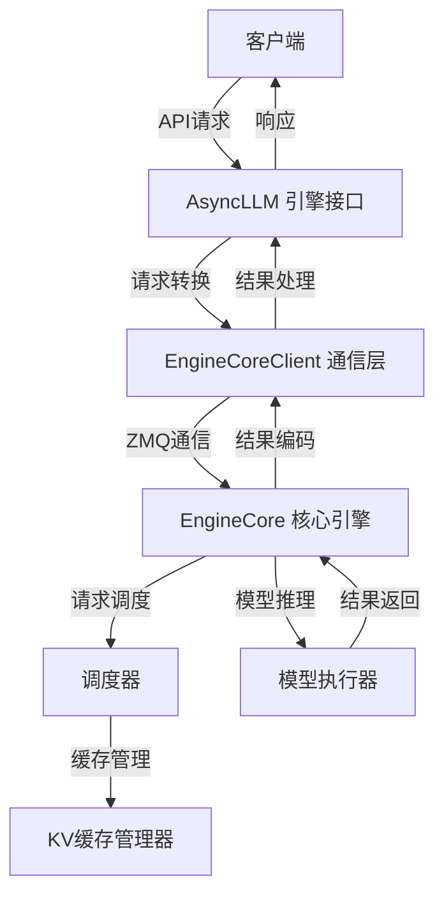
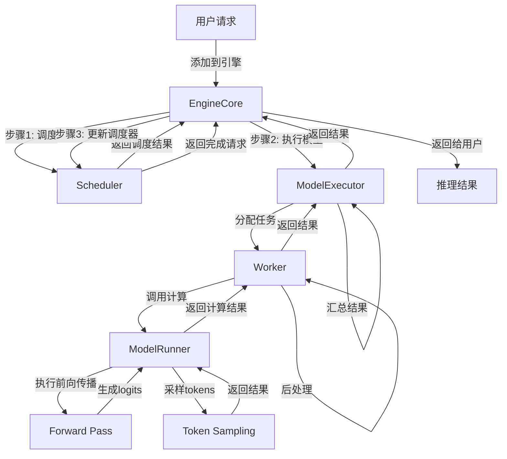
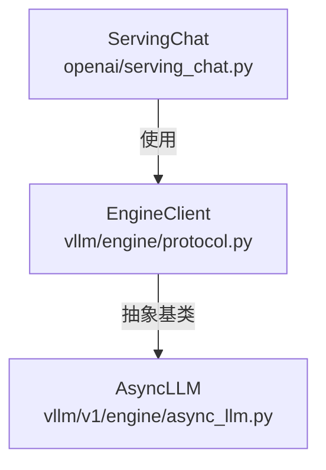
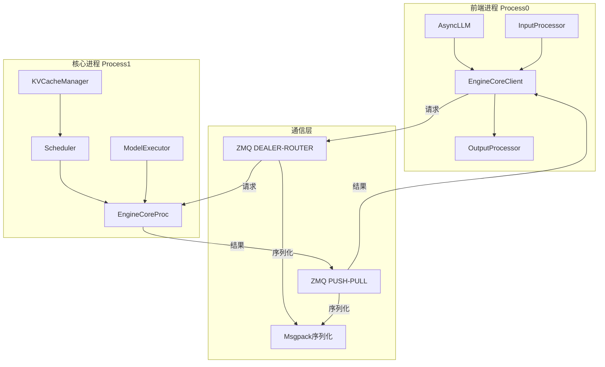
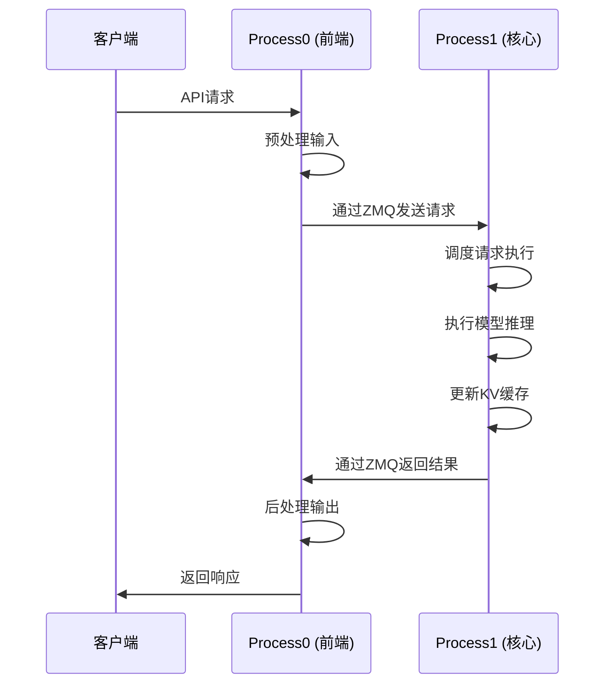
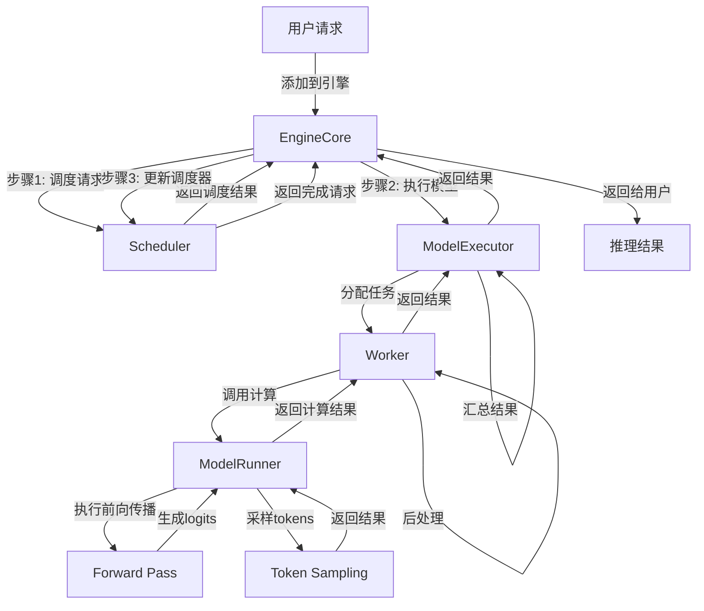

# vLLM 请求处理流程分析

## 1. 整体架构概述

vLLM采用分层架构设计，主要包含以下核心组件：



## 2. 请求处理流程

### 2.1 请求接收与预处理

当客户端发送请求时，首先由`AsyncLLM`类（`vllm/v1/engine/async_llm.py`）的`generate`方法（第360-469行）接收：

```python
async def generate(
    self,
    prompt: EngineCoreRequest | PromptType,
    sampling_params: SamplingParams,
    request_id: str,
    *,
    prompt_text: str | None = None,
    lora_request: LoRARequest | None = None,
    tokenization_kwargs: dict[str, Any] | None = None,
    trace_headers: Mapping[str, str] | None = None,
    priority: int = 0,
    data_parallel_rank: int | None = None,
) -> AsyncGenerator[RequestOutput, None]:
    # 1. 验证请求参数
    if self.vllm_config.cache_config.kv_sharing_fast_prefill and sampling_params.prompt_logprobs:
        raise ValueError("--kv-sharing-fast-prefill produces incorrect logprobs...")
    
    try:
        # 2. 启动输出处理器
        self._run_output_handler()
        
        # 3. 等待引擎恢复（如果已暂停）
        async with self._pause_cond:
            await self._pause_cond.wait_for(lambda: not self._paused)
        
        # 4. 处理输入并添加请求
        q = await self.add_request(
            request_id, prompt, sampling_params, lora_request=lora_request,
            tokenization_kwargs=tokenization_kwargs, trace_headers=trace_headers,
            priority=priority, data_parallel_rank=data_parallel_rank, prompt_text=prompt_text
        )
        
        # 5. 流式返回结果
        finished = False
        while not finished:
            out = q.get_nowait() or await q.get()
            finished = out.finished
            assert isinstance(out, RequestOutput)
            yield out
    
    except (asyncio.CancelledError, GeneratorExit):
        await self.abort(request_id)
        # 其他异常处理...
```

### 2.2 请求转换与发送

`AsyncLLM`将原始请求转换为`EngineCoreRequest`，并通过`EngineCoreClient`发送到引擎核心。这一过程由`add_request`方法（第272-336行）完成：

```python
async def add_request(
    self,
    request_id: str,
    prompt: EngineCoreRequest | PromptType,
    params: SamplingParams | PoolingParams,
    arrival_time: float | None = None,
    lora_request: LoRARequest | None = None,
    tokenization_kwargs: dict[str, Any] | None = None,
    trace_headers: Mapping[str, str] | None = None,
    priority: int = 0,
    data_parallel_rank: int | None = None,
    prompt_text: str | None = None,
) -> RequestOutputCollector:
    """Add new request to the AsyncLLM."""
    
    if self.errored:
        raise EngineDeadError()
    
    is_pooling = isinstance(params, PoolingParams)
    
    # 创建新的输出收集器
    queue = RequestOutputCollector(output_kind=params.output_kind)
    
    # 将输入转换为EngineCoreRequest
    if isinstance(prompt, EngineCoreRequest):
        request = prompt
    else:
        assert prompt_text is None
        request = self.input_processor.process_inputs(
            request_id, prompt, params, arrival_time, lora_request,
            tokenization_kwargs, trace_headers, priority, data_parallel_rank
        )
        # 设置提示文本
        if isinstance(prompt, str):
            prompt_text = prompt
        elif isinstance(prompt, Mapping):
            prompt_text = cast(str | None, prompt.get("prompt"))
    
    # 添加请求到输出处理器
    self.output_processor.add_request(request, prompt_text, None, 0, queue)
    
    # 发送请求到引擎核心
    await self.engine_core.add_request_async(request)
    
    if self.log_requests:
        logger.info("Added request %s.", request.request_id)
    
    return queue
```

### 2.3 引擎核心处理

`EngineCore`（`vllm/v1/engine/core.py`）是vLLM的核心组件，负责请求的实际处理。其核心逻辑位于`run_busy_loop`方法：

```python
def run_busy_loop(self):
    """核心忙碌循环"""
    while True:
        # 处理输入队列中的请求
        self._process_input_queue()
        
        # 执行引擎步骤
        self._process_engine_step()
        
        # 检查引擎是否应该停止
        if self._should_stop:
            break
```

#### 2.3.1 输入队列处理

```python
def _process_input_queue(self):
    """处理输入队列中的请求"""
    while not self.engines_running and not self.scheduler.has_requests() and not self.batch_queue:
        if self.input_queue.empty():
            # 等待工作
            time.sleep(0.01)
        req = self.input_queue.get()
        self._handle_client_request(*req)
    
    # 处理剩余请求
    while not self.input_queue.empty():
        req = self.input_queue.get_nowait()
        self._handle_client_request(*req)
```

#### 2.3.2 请求处理

```python
def _handle_client_request(
    self, request_type: EngineCoreRequestType, request: Any
) -> None:
    """处理客户端请求"""
    if request_type == EngineCoreRequestType.ADD:
        req, request_wave = request
        self.add_request(req, request_wave)
    elif request_type == EngineCoreRequestType.ABORT:
        self.abort_requests(request)
    # 其他请求类型处理...
```

### 2.4 前端引擎层与请求管理

#### 2.4.1 为什么需要前端引擎层？

前端引擎层（以`AsyncLLM`为核心）的存在是vLLM架构设计的关键，主要有以下几个原因：

**前后端分离的设计优势**：
- **职责分离**：
  - 前端（P0）：专注于用户交互、输入/输出处理、请求管理
  - 核心（P1）：专注于高性能模型推理、资源管理、调度
- **稳定性保障**：核心推理进程（P1）不受前端交互影响，降低崩溃风险
- **可扩展性**：前端可以灵活支持多种API接口（如OpenAI兼容、自定义API等），核心保持不变

**前端引擎层的具体职责**：
- **用户接口抽象**：提供统一的`AsyncLLM`接口，隐藏底层复杂实现
- **请求生命周期管理**：从接收请求到返回响应的全流程控制
- **输入预处理**：通过`InputProcessor`验证和转换用户请求
- **输出后处理**：通过`OutputProcessor`格式化和分发结果
- **多进程通信**：通过`EngineCoreClient`与核心进程（P1）通信
- **并发控制**：支持大量并发请求的管理和调度
- **流式输出支持**：实现实时生成结果的流式返回

#### 2.4.2 `add_request` 是添加到哪儿了？

从代码实现来看，`add_request`方法将请求添加到了两个不同的地方：

```python
async def _add_request(
    self,
    request: EngineCoreRequest,
    prompt: str | None,
    parent_req: ParentRequest | None,
    index: int,
    queue: RequestOutputCollector,
):
    # 1. 添加到本地 OutputProcessor（P0中）
    self.output_processor.add_request(request, prompt, parent_req, index, queue)

    # 2. 通过 EngineCoreClient 发送到核心进程（P1中）
    await self.engine_core.add_request_async(request)

    if self.log_requests:
        logger.info("Added request %s.", request.request_id)
```

**添加位置与作用**：
1. **本地 OutputProcessor（P0中）**：
   - 作用：管理请求的输出状态、支持流式输出、处理请求中止
   - 实现：在`OutputProcessor`中维护请求状态字典

2. **核心进程 EngineCore（P1中）**：
   - 作用：实际执行模型推理、资源分配、请求调度
   - 实现：通过`EngineCoreClient`的跨进程通信机制发送请求

#### 2.4.3 完整请求处理流程

下图展示了从用户请求到推理结果的完整处理流程：



**流程说明**：
- **步骤1（调度）**：EngineCore调用Scheduler进行请求调度，确定哪些请求可以并行执行
- **步骤2（执行模型）**：EngineCore将调度结果传递给ModelExecutor，由ModelExecutor分配任务给Worker
- **步骤3（更新调度器）**：EngineCore根据模型执行结果更新调度器状态，完成请求生命周期管理

## 3. API端点差异与调用链

### 3.1 /v1/chat/completions与/v1/completions的区别

这两个API端点都是OpenAI兼容API的一部分，用于生成文本内容，但它们在**请求格式**、**应用场景**和**功能支持**等方面存在显著差异。

#### 3.1.1 请求模型差异

##### 聊天完成 (`ChatCompletionRequest`)
- **核心字段**：`messages` - 对话历史列表，包含角色和内容
- **应用场景**：多轮对话交互
- **典型结构**：
```json
{
  "model": "gpt-3.5-turbo",
  "messages": [
    {"role": "user", "content": "你好"},
    {"role": "assistant", "content": "你好！有什么可以帮助你的吗？"},
    {"role": "user", "content": "什么是人工智能？"}
  ],
  "stream": true
}
```

##### 文本补全 (`CompletionRequest`)
- **核心字段**：`prompt` - 单个或多个输入文本
- **应用场景**：简单的文本补全、续写
- **典型结构**：
```json
{
  "model": "text-davinci-003",
  "prompt": "什么是人工智能？",
  "max_tokens": 100,
  "stream": false
}
```

#### 3.1.2 功能支持对比

| 功能 | 聊天完成 (`/v1/chat/completions`) | 文本补全 (`/v1/completions`) |
|------|----------------------------------|-----------------------------|
| 对话历史管理 | ✅ 内置支持多轮对话 | ❌ 需手动构建上下文 |
| 工具调用 | ✅ 支持 `tools` 和 `tool_choice` | ❌ 不支持 |
| 特殊角色 | ✅ 支持 `system`、`user`、`assistant` 等角色 | ❌ 不区分角色 |
| 结构化输出 | ✅ 支持 `response_format` | ✅ 支持 `response_format` |
| 流输出 | ✅ 支持 | ✅ 支持 |
| Beam搜索 | ✅ 支持 | ✅ 支持 |
| 后缀添加 | ❌ 不支持 | ✅ 支持 `suffix` 字段 |
| 回显提示 | ✅ 支持 `echo` 字段 | ✅ 支持 `echo` 字段 |

### 3.2 /v1/chat/completions的调用链

#### 3.2.1 关键类关系



**核心关系**：
- `EngineClient` 是一个抽象基类，定义了生成接口
- `AsyncLLM` 继承自 `EngineClient`，实现了 `generate()` 方法
- `ServingChat` 类通过 `self.engine_client` 实例调用 `generate()` 方法

#### 3.2.2 完整调用链

```mermaid
sequenceDiagram
    participant User as 用户
    participant FastAPI as FastAPI
    participant API as api_server.py
    participant ServingChat as ServingChat
    participant EngineClient as EngineClient
    participant AsyncLLM as AsyncLLM
    participant EngineCore as EngineCore
    
    User->>FastAPI: POST /v1/chat/completions
    FastAPI->>API: create_chat_completion()
    API->>ServingChat: handler.create_chat_completion()
    
    ServingChat->>ServingChat: 处理messages并构建engine_prompt
    ServingChat->>ServingChat: 计算max_tokens和sampling_params
    
    ServingChat->>EngineClient: self.engine_client.generate(
        engine_request,
        sampling_params,
        sub_request_id,
        ...
    )
    
    EngineClient->>AsyncLLM: 调用实现方法
    AsyncLLM->>AsyncLLM: validate_config()
    AsyncLLM->>AsyncLLM: _run_output_handler()
    AsyncLLM->>AsyncLLM: add_request()
    AsyncLLM->>EngineCore: engine_core.add_request_async()
    
    EngineCore->>EngineCore: 执行模型推理
    EngineCore-->>AsyncLLM: 返回推理结果
    AsyncLLM-->>ServingChat: 返回AsyncGenerator
    ServingChat-->>API: 转换为聊天响应格式
    API-->>FastAPI: 返回JSON/流式响应
    FastAPI-->>User: 返回响应
```

#### 3.2.3 关键调用位置

**在 `serving_chat.py` 中调用 `generate()`**：
```python
# vllm/entrypoints/openai/serving_chat.py:337-347
generator = self.engine_client.generate(
    engine_request,
    sampling_params,
    sub_request_id,
    lora_request=lora_request,
    trace_headers=trace_headers,
    priority=request.priority,
    prompt_text=prompt_text,
    tokenization_kwargs=tokenization_kwargs,
    data_parallel_rank=data_parallel_rank,
)
```

**`AsyncLLM` 实现 `EngineClient` 接口**：
```python
# vllm/v1/engine/async_llm.py:54
class AsyncLLM(EngineClient):
    # 实现了EngineClient的所有抽象方法
    async def generate(
        self,
        prompt: EngineCoreRequest | PromptType,
        sampling_params: SamplingParams,
        request_id: str,
        *,  # 后续参数为关键字参数
        prompt_text: str | None = None,
        lora_request: LoRARequest | None = None,
        tokenization_kwargs: dict[str, Any] | None = None,
        trace_headers: Mapping[str, str] | None = None,
        priority: int = 0,
        data_parallel_rank: int | None = None,
    ) -> AsyncGenerator[RequestOutput, None]:
        # 方法实现...
```

## 4. 调度机制

### 4.1 调度器概述

调度器（`vllm/v1/core/sched/scheduler.py`）负责管理请求队列、分配资源和决定执行顺序。核心调度逻辑位于`schedule`方法（第216-651行）：

```python
def schedule(self) -> SchedulerOutput:
    """调度请求"""
    # NOTE(woosuk) on the scheduling algorithm:
    # There's no "decoding phase" nor "prefill phase" in the scheduler.
    # Each request just has the num_computed_tokens and num_tokens_with_spec.
    # num_tokens_with_spec = len(prompt_token_ids) + len(output_token_ids) + len(spec_token_ids).
    # At each step, the scheduler tries to assign tokens to the requests
    # so that each request's num_computed_tokens can catch up its num_tokens_with_spec.
    
    scheduled_new_reqs: list[Request] = []
    scheduled_resumed_reqs: list[Request] = []
    scheduled_running_reqs: list[Request] = []
    preempted_reqs: list[Request] = []
    
    req_to_new_blocks: dict[str, KVCacheBlocks] = {}
    num_scheduled_tokens: dict[str, int] = {}
    token_budget = self.max_num_scheduled_tokens
    
    # 1. 调度RUNNING状态的请求
    req_index = 0
    while req_index < len(self.running) and token_budget > 0:
        request = self.running[req_index]
        
        # 检查是否需要调度额外的步骤
        if (request.num_output_placeholders > 0 and 
            request.num_computed_tokens + 2 - request.num_output_placeholders >= 
            request.num_prompt_tokens + request.max_tokens):
            req_index += 1
            continue
            
        # 计算需要调度的新token数量
        num_new_tokens = request.num_tokens_with_spec - request.num_computed_tokens
        
        # 分配KV缓存块
        new_blocks = self.kv_cache_manager.allocate_slots(request, num_new_tokens)
        if new_blocks is None:
            # 资源不足，跳过该请求
            req_index += 1
            continue
        
        # 更新调度信息
        req_to_new_blocks[request.request_id] = new_blocks
        num_scheduled_tokens[request.request_id] = num_new_tokens
        scheduled_running_reqs.append(request)
        token_budget -= num_new_tokens
        req_index += 1
    
    # 2. 调度WAITING状态的请求
    # ... (类似的调度逻辑)
    
    # 3. 构建调度输出
    output = SchedulerOutput(
        scheduled_new_reqs=scheduled_new_reqs,
        scheduled_resumed_reqs=scheduled_resumed_reqs,
        scheduled_running_reqs=scheduled_running_reqs,
        preempted_reqs=preempted_reqs,
        req_to_new_blocks=req_to_new_blocks,
        num_scheduled_tokens=num_scheduled_tokens,
    )
    
    return output
```

### 3.2 请求状态管理

vLLM的请求有以下主要状态：

- `WAITING`：等待调度
- `WAITING_FOR_REMOTE_KVS`：等待远程KV缓存
- `RUNNING`：正在执行
- `PREEMPTED`：被抢占
- `FINISHED_STOPPED`：正常完成
- `FINISHED_ABORTED`：被中止

### 3.3 调度策略

调度器支持多种调度策略（`SchedulingPolicy`）：

- **FCFS（First-Come, First-Served）**：先进先出
- **Priority**：基于优先级的调度

```python
# 创建请求队列
self.waiting = create_request_queue(self.policy)
```

### 3.4 资源管理

调度器考虑以下资源限制：

- `max_num_running_reqs`：最大并发请求数
- `max_num_scheduled_tokens`：最大批处理token数
- `max_model_len`：模型最大长度

```python
# 调度约束
self.max_num_running_reqs = self.scheduler_config.max_num_seqs
self.max_num_scheduled_tokens = self.scheduler_config.max_num_batched_tokens
self.max_model_len = vllm_config.model_config.max_model_len
```

## 4. 推理过程

### 4.1 模型执行

`ModelExecutor`负责实际的模型推理：

```python
def step(self) -> tuple[dict[int, EngineCoreOutputs], bool]:
    """执行引擎步骤"""
    # 1. 检查是否有请求需要处理
    if not self.scheduler.has_requests():
        return {}, False
    
    # 2. 调度请求
    scheduler_output = self.scheduler.schedule()
    
    # 3. 执行模型
    future = self.model_executor.execute_model(scheduler_output, non_block=True)
    
    # 4. 采样tokens
    grammar_output = self.scheduler.get_grammar_bitmask(scheduler_output)
    model_output = future.result()
    if model_output is None:
        model_output = self.model_executor.sample_tokens(grammar_output)
    
    # 5. 处理模型输出
    self._process_aborts_queue()
    engine_core_outputs = self.scheduler.update_from_output(scheduler_output, model_output)
    
    return engine_core_outputs, scheduler_output.total_num_scheduled_tokens > 0
```

### 4.2 KV缓存管理

vLLM使用高效的KV缓存管理机制，包括：

- 块级缓存分配
- 前缀缓存
- 缓存共享

```python
# 分配KV缓存块
new_blocks = self.kv_cache_manager.allocate_slots(
    request,
    num_new_tokens,
    num_lookahead_tokens=self.num_lookahead_tokens,
)
```

### 4.3 批处理优化

vLLM支持批处理多个请求以提高效率：

```python
# 计算总调度tokens
total_num_scheduled_tokens = sum(num_scheduled_tokens.values())
assert total_num_scheduled_tokens <= self.max_num_scheduled_tokens
```

## 5. 结果处理与返回

### 5.1 输出处理

```python
async def output_handler():
    try:
        while True:
            # 1. 从引擎核心获取输出
            outputs = await engine_core.get_output_async()
            
            # 2. 处理输出
            processed_outputs = output_processor.process_outputs(
                outputs.outputs, outputs.timestamp, iteration_stats
            )
            
            # 3. 处理需要中止的请求
            await engine_core.abort_requests_async(processed_outputs.reqs_to_abort)
            
            # 4. 记录统计信息
            if logger_manager:
                logger_manager.record(
                    engine_idx=outputs.engine_index,
                    scheduler_stats=outputs.scheduler_stats,
                    iteration_stats=iteration_stats,
                    mm_cache_stats=input_processor.stat_mm_cache(),
                )
    except Exception as e:
        logger.exception("AsyncLLM output_handler failed.")
        output_processor.propagate_error(e)
```

### 5.2 结果返回

结果通过异步生成器返回给客户端：

```python
# 输出处理器任务将项目推送到队列
# 此任务从队列中拉取并返回给调用者
finished = False
while not finished:
    out = q.get_nowait() or await q.get()
    finished = out.finished
    assert isinstance(out, RequestOutput)
    yield out
```

## 6. 关键技术特点

### 6.1 异步处理

vLLM采用全异步设计，提高了并发处理能力：

```python
# 异步生成器返回结果
async def generate(...) -> AsyncGenerator[RequestOutput, None]:
    # ...
    while not finished:
        out = q.get_nowait() or await q.get()
        finished = out.finished
        yield out
```

### 6.2 高效调度

调度器支持优先级调度和资源限制，确保高效利用GPU资源：

```python
# 基于优先级的抢占
if self.policy == SchedulingPolicy.PRIORITY:
    preempted_req = max(
        self.running,
        key=lambda r: (r.priority, r.arrival_time),
    )
    self.running.remove(preempted_req)
    # ...
```

### 6.3 内存管理

vLLM使用高效的内存管理机制，包括：

- 块级KV缓存
- 前缀缓存
- 动态内存分配

```python
# KV缓存管理器
self.kv_cache_manager = KVCacheManager(
    kv_cache_config=kv_cache_config,
    max_model_len=self.max_model_len,
    enable_caching=self.cache_config.enable_prefix_caching,
    # ...
)
```

## 7. 代码优化建议

### 7.1 错误处理改进

在`AsyncLLM.generate`方法中，错误处理可以更加详细：

```python
# 当前代码
except Exception as e:
    await self.abort(request_id)
    if self.log_requests:
        logger.info("Request %s failed.", request_id)
    raise EngineGenerateError() from e

# 优化建议
except Exception as e:
    await self.abort(request_id)
    if self.log_requests:
        logger.error("Request %s failed: %s", request_id, str(e), exc_info=True)
    raise EngineGenerateError(f"Request {request_id} failed: {str(e)}") from e
```

### 7.2 性能监控增强

在`EngineCore._process_engine_step`方法中添加更多性能监控：

```python
def _process_engine_step(self) -> bool:
    """执行引擎步骤"""
    start_time = time.time()
    
    # 执行引擎步骤
    outputs, model_executed = self.step_fn()
    
    # 记录执行时间
    execution_time = time.time() - start_time
    logger.debug("Engine step took %.4f seconds", execution_time)
    
    # 其他处理...
    return model_executed
```

### 7.3 资源限制检查

在`Scheduler.schedule`方法中添加更多资源限制检查：

```python
# 当前代码
total_num_scheduled_tokens = sum(num_scheduled_tokens.values())
assert total_num_scheduled_tokens <= self.max_num_scheduled_tokens

# 优化建议
total_num_scheduled_tokens = sum(num_scheduled_tokens.values())
if total_num_scheduled_tokens > self.max_num_scheduled_tokens:
    logger.warning("Scheduled tokens %d exceeds limit %d", 
                  total_num_scheduled_tokens, self.max_num_scheduled_tokens)
    # 可以选择调整调度策略
```

## 8. 进程模型与通信机制

### 8.1 process0 (P0) 与 process1 (P1) 的区别

#### P0 - 前端进程
- **主要职责**：
  - 处理客户端API请求
  - 管理tokenizer和输入预处理
  - 协调与EngineCore的通信
  - 处理输出后处理和格式化
- **核心组件**：
  - AsyncLLM引擎接口
  - EngineCoreClient通信层
  - InputProcessor和OutputProcessor
- **文件位置**：
  - `vllm/v1/engine/async_llm.py`

#### P1 - 核心进程
- **主要职责**：
  - 执行模型推理计算
  - 管理KV缓存
  - 调度请求执行
  - 处理低级别硬件交互
- **核心组件**：
  - EngineCore核心引擎
  - Scheduler调度器
  - ModelExecutor模型执行器
  - KVCacheManager缓存管理器
- **文件位置**：
  - `vllm/v1/engine/core.py`

### 8.2 P0与P1之间的通信机制



#### 8.2.1 通信协议
- **使用技术**：ZMQ（ZeroMQ）通信库
- **通信模式**：
  - 请求发送：DEALER-ROUTER模式，支持异步多请求
  - 结果返回：PUSH-PULL模式，高效传递批量结果
- **文件位置**：
  - `vllm/v1/engine/core.py` - `process_input_sockets()`和`process_output_sockets()`方法

#### 8.2.2 数据序列化
- **使用技术**：Msgpack序列化
- **优势**：
  - 高效的二进制序列化
  - 支持复杂数据结构（包括张量）
  - 快速的序列化和反序列化
- **文件位置**：
  - `vllm/v1/engine/core.py` - `MsgpackDecoder`和`MsgpackEncoder`

#### 8.2.3 缓存同步机制
- **设计理念**：
  - P0和P1维护镜像缓存结构
  - 确保缓存驱逐顺序一致
  - 避免不必要的跨进程通信
- **实现方式**：
  - P0缓存元数据和哈希值
  - P1缓存实际的特征数据
  - 通过`get_and_update()`方法确保操作原子性
- **文件位置**：
  - `vllm/multimodal/cache.py`

### 8.3 请求处理中的进程交互




## 9. 模型执行流程
#### 4. 通信机制
- **EngineCore ↔ ModelExecutor**：本地方法调用或消息队列
- **ModelExecutor ↔ Worker**：多进程通信（共享内存、套接字等）
- **Worker ↔ ModelRunner**：本地方法调用（同一进程内）

#### 5. 完整调用流程可视化



#### 6. 调用过程时序详细描述

1. **请求调度阶段**
   - EngineCore调用`scheduler.schedule()`获取调度结果
   - 调度器根据请求优先级、资源限制等条件决定哪些请求可以执行
   - 返回包含要执行的请求的`scheduler_output`

2. **模型执行阶段**
   - EngineCore调用`model_executor.execute_model(scheduler_output)`
   - ModelExecutor根据配置选择合适的Worker
   - 向选中的Worker发送执行请求，包含`scheduler_output`中的所有必要信息

3. **Worker预处理阶段**
   - Worker接收请求后，对输入数据进行预处理
   - 根据请求类型和模型需求准备必要的资源
   - 设置性能分析上下文

4. **ModelRunner计算阶段**
   - Worker调用`model_runner.execute_model()`执行实际的模型计算
   - ModelRunner执行前向传播，生成logits
   - 对logits进行采样，生成新的tokens

5. **结果处理阶段**
   - ModelRunner返回计算结果给Worker
   - Worker对结果进行后处理
   - Worker将结果返回给ModelExecutor

6. **结果汇总阶段**
   - ModelExecutor汇总所有Worker的结果
   - 将汇总结果返回给EngineCore

7. **调度器更新阶段**
   - EngineCore调用`scheduler.update_from_output()`更新调度器状态
   - 标记已完成的请求
   - 准备处理下一批请求

8. **结果返回阶段**
   - EngineCore将完成的请求结果返回给前端
   - 前端将结果返回给用户

#### 7. 代码位置汇总
- EngineCore调用ModelExecutor：`vllm/v1/engine/core.py:348`
- ModelExecutor调用Worker：`vllm/v1/executor/multiproc_executor.py`
- Worker调用ModelRunner：`vllm/v1/worker/gpu_worker.py:623`
- ModelRunner执行模型：`vllm/v1/worker/gpu_model_runner.py`或`vllm/v1/worker/gpu/model_runner.py`

## 9. 总结

vLLM采用分层架构设计，具有高效的请求处理流程和调度机制：

1. **异步处理**：全异步设计提高并发能力
2. **高效调度**：支持多种调度策略和资源限制
3. **内存优化**：块级KV缓存和前缀缓存减少内存使用
4. **批处理**：批量处理多个请求提高GPU利用率
5. **多进程架构**：P0和P1分离，提高系统稳定性和可扩展性
6. **高效通信**：ZMQ和Msgpack确保进程间通信高效可靠

vLLM的设计使得它能够高效地处理大量并发请求，同时保持低延迟和高吞吐量，是一个优秀的大语言模型推理框架。其多进程架构和高效通信机制为大规模模型部署提供了可靠的基础。