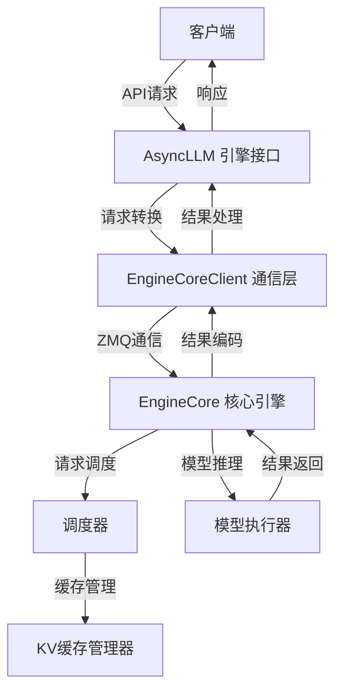
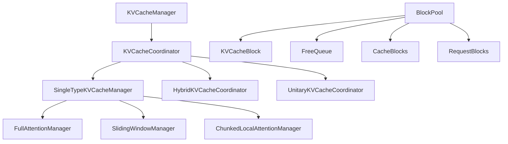
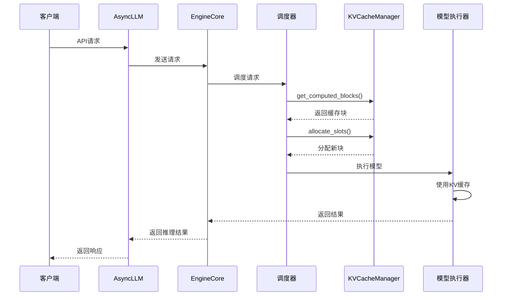

# vLLM 请求处理流程与KVCache管理机制分析

## 1. 整体架构概述

vLLM采用分层架构设计，主要包含以下核心组件：



## 2. KVCache管理机制深度解析

### 2.1 KVCache的核心作用

KVCache（Key-Value缓存）是Transformer模型推理过程中的关键优化技术，主要作用：
- **避免重复计算**：缓存已计算的Key和Value向量
- **提升推理速度**：减少解码阶段的重复计算
- **支持长序列**：通过分块管理支持超长序列处理

### 2.2 KVCache管理架构



### 2.3 KVCache分配流程

#### 2.3.1 缓存块分配过程

```python
def allocate_slots(
    self,
    request: Request,
    num_new_tokens: int,
    num_new_computed_tokens: int = 0,
    new_computed_blocks: KVCacheBlocks | None = None,
    num_lookahead_tokens: int = 0
) -> KVCacheBlocks | None:
    """分配KV缓存槽位"""
    
    # 1. 释放跳过的块（如滑动窗口外的块）
    self.coordinator.remove_skipped_blocks(request.request_id, request.num_computed_tokens)
    
    # 2. 计算需要分配的总token数
    num_tokens_need_slot = min(
        num_computed_tokens + num_new_tokens + num_lookahead_tokens,
        self.max_model_len
    )
    
    # 3. 计算需要分配的块数
    num_blocks_to_allocate = self.coordinator.get_num_blocks_to_allocate(
        request_id=request.request_id,
        num_tokens=num_tokens_need_slot,
        new_computed_blocks=new_computed_block_list
    )
    
    # 4. 检查是否有足够的空闲块
    if num_blocks_to_allocate > self.block_pool.get_num_free_blocks():
        return None
    
    # 5. 触碰已计算的块（防止被驱逐）
    if self.enable_caching:
        self.block_pool.touch(new_computed_block_list)
    
    # 6. 分配新块
    new_blocks = self.coordinator.allocate_new_blocks(
        request.request_id, num_tokens_need_slot
    )
    
    # 7. 缓存块（如果启用缓存）
    if self.enable_caching:
        num_tokens_to_cache = min(
            num_computed_tokens + num_new_tokens, request.num_tokens
        )
        self.coordinator.cache_blocks(request, num_tokens_to_cache)
    
    return self.create_kv_cache_blocks(new_blocks)
```

#### 2.3.2 块布局说明

```
块布局示意图：
-----------------------------------------------------------------------
| < computed > | < new computed > |    < new >    | < pre-allocated > |
-----------------------------------------------------------------------
|                  < required >                   |
--------------------------------------------------
|                    < full >                  |
-----------------------------------------------
                                          | <new full> |
                                          --------------
```

### 2.4 前缀缓存机制

#### 2.4.1 前缀缓存原理

前缀缓存通过哈希匹配技术实现：
- **提示词哈希**：对提示词进行哈希生成唯一标识
- **缓存查找**：在缓存中查找匹配的哈希值
- **块复用**：如果找到匹配的缓存块，直接复用

```python
def get_computed_blocks(self, request: Request) -> tuple[KVCacheBlocks, int]:
    """获取已计算的缓存块"""
    if not self.enable_caching or request.skip_reading_prefix_cache:
        return self.empty_kv_cache_blocks, 0
    
    max_cache_hit_length = request.num_tokens - 1
    computed_blocks, num_new_computed_tokens = (
        self.coordinator.find_longest_cache_hit(
            request.block_hashes, max_cache_hit_length
        )
    )
    
    return self.create_kv_cache_blocks(computed_blocks), num_new_computed_tokens
```

#### 2.4.2 缓存命中策略

- **最长匹配**：查找最长的匹配前缀
- **块对齐**：确保计算token数与块大小对齐
- **性能统计**：记录缓存命中率和性能指标

### 2.5 混合KV缓存管理器

对于包含多种注意力机制的混合模型，vLLM使用HybridKVCacheCoordinator：

#### 2.5.1 支持的类型组合

- **全注意力 + 滑动窗口注意力**
- **全注意力 + 分块局部注意力**
- **多种注意力机制的混合**

#### 2.5.2 内存布局优化

```python
# 示例：10个全注意力层 + 20个滑动窗口层
# 分为3个组进行管理
Group 0: 10 full attention layers (full.0 - full.9)
Group 1: 10 sliding window layers (sw.0 - sw.9)
Group 2: 10 sliding window layers (sw.10 - sw.19)
```

### 2.6 缓存块管理

#### 2.6.1 BlockPool核心组件

```python
class BlockPool:
    """缓存块池管理"""
    
    def __init__(self, num_gpu_blocks: int, enable_caching: bool, hash_block_size: int):
        self.num_gpu_blocks = num_gpu_blocks
        self.enable_caching = enable_caching
        self.hash_block_size = hash_block_size
        
        # 核心数据结构
        self.blocks: list[KVCacheBlock] = []
        self.free_queue: FreeQueue = FreeQueue()
        self.cache_blocks: dict[str, KVCacheBlock] = {}
        self.request_blocks: dict[str, list[KVCacheBlock]] = {}
```

#### 2.6.2 块分配策略

- **LRU驱逐**：当缓存满时，驱逐最近最少使用的块
- **引用计数**：跟踪每个块被多少个请求使用
- **块状态管理**：管理块的分配、释放、缓存状态

### 2.7 性能优化特性

#### 2.7.1 块大小优化

vLLM支持动态块大小配置：
- **默认块大小**：通常为16个token
- **可配置性**：根据模型特性调整块大小
- **内存对齐**：确保块大小与硬件特性对齐

#### 2.7.2 内存使用监控

```python
@property
def usage(self) -> float:
    """获取KV缓存使用率"""
    return self.block_pool.get_usage()

def make_prefix_cache_stats(self) -> PrefixCacheStats | None:
    """获取前缀缓存统计"""
    if not self.log_stats:
        return None
    stats = self.prefix_cache_stats
    self.prefix_cache_stats = PrefixCacheStats()
    return stats
```

## 3. 请求处理流程

### 3.1 完整处理流程



### 3.2 调度器与KVCache的交互

调度器在每次调度时都会与KVCacheManager交互：

```python
def schedule(self) -> SchedulerOutput:
    """调度请求"""
    # 1. 调度运行中的请求
    for request in self.running:
        # 计算需要的新token数
        num_new_tokens = request.num_tokens_with_spec - request.num_computed_tokens
        
        # 分配KV缓存块
        new_blocks = self.kv_cache_manager.allocate_slots(request, num_new_tokens)
        if new_blocks is None:
            # 资源不足，跳过该请求
            continue
        
        # 更新调度信息
        req_to_new_blocks[request.request_id] = new_blocks
        num_scheduled_tokens[request.request_id] = num_new_tokens
```

## 4. 关键技术优势

### 4.1 高性能特性

1. **零拷贝缓存**：通过块复用实现零拷贝缓存访问
2. **高效内存管理**：使用块池和自由队列管理内存
3. **智能缓存策略**：基于LRU和引用计数的缓存管理

### 4.2 可扩展性

1. **多注意力机制支持**：支持全注意力、滑动窗口、分块局部注意力等
2. **混合模型支持**：通过HybridKVCacheCoordinator支持混合模型
3. **分布式支持**：支持多GPU和多节点的KV缓存管理

### 4.3 资源优化

1. **内存使用优化**：通过块共享减少内存占用
2. **计算优化**：避免重复计算，提升推理速度
3. **调度优化**：与调度器紧密集成，优化资源分配

## 5. 配置与调优

### 5.1 关键配置参数

```python
# KV缓存配置示例
kv_cache_config = KVCacheConfig(
    num_blocks=1000,  # 缓存块数量
    kv_cache_tensors=[],
    kv_cache_groups=[
        KVCacheGroupSpec(
            ["layer"], 
            FullAttentionSpec(block_size=16, num_kv_heads=32, head_size=128, dtype=torch.float16)
        )
    ]
)
```

### 5.2 性能调优建议

1. **块大小优化**：根据模型序列长度调整块大小
2. **缓存大小配置**：根据可用内存配置合适的缓存大小
3. **监控指标**：监控缓存命中率和内存使用率

## 6. 总结

KVCache是vLLM高性能推理的核心技术，通过高效的缓存管理机制：
- 显著提升了长序列处理的性能
- 支持多种注意力机制的混合模型
- 提供了灵活的可配置性和扩展性
- 与调度器紧密集成，实现资源的最优利用

这种设计使得vLLM能够在保持高吞吐量的同时，支持复杂的模型架构和长序列处理需求。