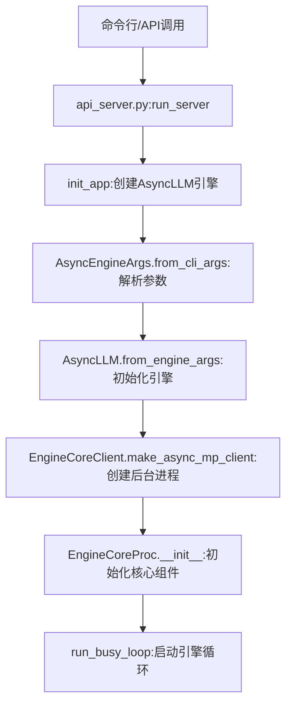
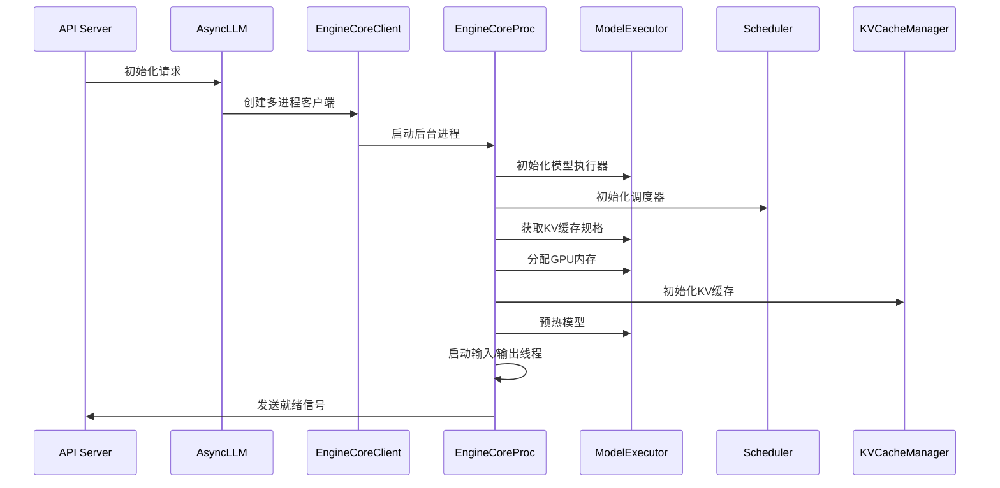
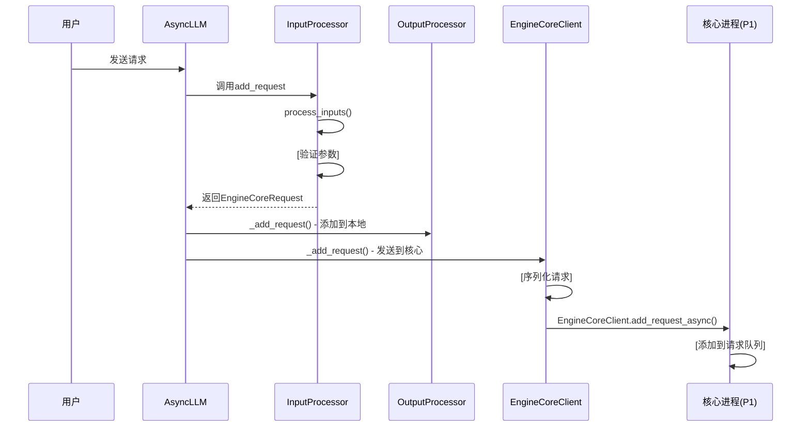
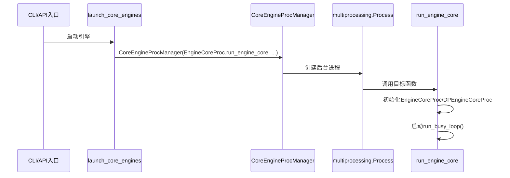

# vLLM 启动过程分析

## 1. 启动入口与初始化链

vLLM的启动过程始于命令行或API调用，主要通过以下路径初始化：



## 1.1 项目核心组件概述

vLLM项目主要由以下核心组件构成，各部分功能如下：

### 1.1.1 入口层（如 `api_server.py`）
- **功能**：处理客户端API请求的入口点，负责启动服务器、初始化引擎和处理HTTP请求。
- **核心函数**：`run_server` - 服务器启动和初始化的主函数。

### 1.1.2 前端引擎层（`AsyncLLM`）
- **功能**：作为用户与系统交互的接口层，负责请求的接收、预处理、结果后处理和响应返回。
- **核心函数**：`generate` - 处理生成请求的入口；`add_request` - 转换请求并发送到核心进程。

### 1.1.3 通信层（`EngineCoreClient`）
- **功能**：实现前端进程（P0）和核心进程（P1）之间的通信。
- **技术**：使用ZeroMQ (ZMQ) 进行跨进程通信，Msgpack进行数据序列化。

### 1.1.4 核心引擎层（`EngineCore`）
- **功能**：vLLM的核心处理单元，负责请求调度、模型推理、资源管理和结果生成。
- **核心组件**：
  - 调度器：管理请求队列和执行顺序
  - 模型执行器：执行实际的模型推理
  - KV缓存管理器：管理键值缓存以提高性能
- **关键特点**：运行在独立进程（P1）中，专注于高效的模型推理。

### 1.1.5 调度器（`Scheduler`）
- **功能**：管理请求的执行顺序、分配资源和决定哪些请求可以同时运行。
- **核心函数**：`schedule` - 根据优先级和资源限制调度请求。

### 1.1.6 模型执行器（`ModelExecutor`）
- **功能**：负责实际的模型推理计算，执行token生成和采样。
- **核心函数**：`step` - 执行引擎步骤，包括调度和模型推理。

### 1.1.7 KV缓存管理器（`KVCacheManager`）
- **功能**：高效管理注意力机制的键值缓存，包括块分配、前缀缓存和缓存共享。
- **关键技术**：PagedAttention算法，实现高效的内存管理。

### 1.1.8 模型运行器（`ModelRunner`）
- **功能**：执行实际的模型推理计算，是vLLM的底层计算引擎。
- **技术**：支持GPU、TPU等硬件加速，实现高效的模型前向传播和token采样。
- **关键组件**：
  - 模型加载器：负责加载模型权重和配置
  - 前向传播引擎：执行模型的前向计算
  - 采样器：根据模型输出生成最终的token序列
- **版本选择**：支持V1和V2两个版本，V2版本提供了更优化的性能和扩展性

## 2. 核心组件初始化顺序



## 3. 详细启动步骤

### 3.1 参数解析与环境准备
- **文件位置**：`vllm/entrypoints/api_server.py`
- **核心函数**：`run_server` (第125-151行) 和 `__main__` (第154-184行)
- **关键步骤**：
  ```python
  async def run_server(args: Namespace, llm_engine: AsyncLLMEngine | None = None, **uvicorn_kwargs: Any) -> None:
      # 设置系统资源限制
      set_ulimit()
      # 初始化应用和引擎
      app = await init_app(args, llm_engine)
      # 启动HTTP服务器
      shutdown_task = await serve_http(app, host=args.host, port=args.port, ...)
      await shutdown_task
  ```
  - 解析命令行参数：`AsyncEngineArgs.add_cli_args(parser)` (第182行)
  - 设置系统资源限制：`set_ulimit()` (第131行)
  - 初始化日志系统：`init_logger()` (第34行)

### 3.2 AsyncLLM引擎初始化
- **文件位置**：`vllm/v1/engine/async_llm.py`
- **核心函数**：`AsyncLLM.__init__` (第55-153行)
- **关键步骤**：
  ```python
  def __init__(self, vllm_config: VllmConfig, executor_class: type[Executor], ...) -> None:
      # 注册配置序列化器
      maybe_register_config_serialize_by_value()
      
      # 初始化tokenizer
      if self.model_config.skip_tokenizer_init:
          tokenizer = None
      else:
          tokenizer = cached_tokenizer_from_config(self.model_config)
      
      # 创建输入/输出处理器
      self.input_processor = InputProcessor(self.vllm_config, tokenizer)
      self.output_processor = OutputProcessor(self.tokenizer, ...)
      
      # 创建EngineCoreClient（核心操作）
      self.engine_core = EngineCoreClient.make_async_mp_client(
          vllm_config=vllm_config, executor_class=executor_class, ...
      )
  ```
  - 注册配置序列化器：`maybe_register_config_serialize_by_value()` (第92行)
  - 初始化tokenizer：`cached_tokenizer_from_config()` (第114行)
  - 创建输入处理器：`InputProcessor()` (第116行)
  - 创建输出处理器：`OutputProcessor()` (第123行)
  - **核心操作**：创建EngineCoreClient：`EngineCoreClient.make_async_mp_client()` (第134-141行)

### 3.3 EngineCoreClient启动
- **文件位置**：`vllm/v1/engine/core_client.py`和`vllm/v1/engine/core.py`
- **核心函数**：
  - `EngineCoreClient.make_async_mp_client` (第98-121行，core_client.py)
  - `run_engine_core` (第823-874行，core.py)
- **关键步骤**：
  ```python
  def make_async_mp_client(vllm_config: VllmConfig, ...) -> "MPClient":
      parallel_config = vllm_config.parallel_config
      if parallel_config.data_parallel_size > 1:
          if parallel_config.data_parallel_external_lb:
              return DPAsyncMPClient(*client_args)
          return DPLBAsyncMPClient(*client_args)
      return AsyncMPClient(*client_args)
  ```
  - 根据数据并行配置选择客户端类型（第115-121行）
  - 在后台进程中启动EngineCore：`run_engine_core()` (第859行，在进程中执行)

### 3.4 EngineCore初始化与核心调用

#### 3.4.1 EngineCoreProc初始化
- **文件位置**：`vllm/v1/engine/core.py`
- **核心函数**：`EngineCoreProc.__init__` (第589-678行)

```python
def __init__(self, vllm_config: VllmConfig, ...) -> None:
    # 设置信号处理器
    signal.signal(signal.SIGTERM, signal_handler)
    signal.signal(signal.SIGINT, signal_handler)
    
    # 初始化数据并行环境
    self._init_data_parallel(vllm_config)
    
    # 父类EngineCore初始化
    super().__init__(vllm_config, executor_class, log_stats, executor_fail_callback)
    
    # 创建输入输出线程
    ready_event = threading.Event()
    input_thread = threading.Thread(target=self.process_input_sockets, ...)
    input_thread.start()
    output_thread = threading.Thread(target=self.process_output_sockets, ...)
    output_thread.start()
```

- **关键步骤说明**：
  - 设置信号处理器：第841-842行，处理SIGTERM和SIGINT信号
  - 初始化数据并行环境：`_init_data_parallel()` (第635行)
  - 创建输入输出线程：
    - 输入线程：`process_input_sockets()` (第647-657行)
    - 输出线程：`process_output_sockets()` (第659-669行)

#### 3.4.2 EngineCore父类初始化
- **核心函数**：`EngineCore.__init__`

```python
def __init__(self, vllm_config: VllmConfig, ...):
    # 初始化调度器
    self.scheduler = Scheduler(...)
    # 初始化模型执行器
    self.model_executor = ModelExecutor(...)
    # 初始化KV缓存管理器
    self.kv_cache_manager = KVCacheManager(...)
    # 初始化结构化输出管理器
    self.structured_output_manager = StructuredOutputManager(...)
```

- **关键组件说明**：
  - 创建模型执行器：根据配置选择不同实现（如MultiprocExecutor）
  - 创建调度器：管理请求的执行顺序
  - 初始化KV缓存：`_initialize_kv_caches()` (第218-264行)
  - 初始化结构化输出管理器：处理结构化输出任务

#### 3.4.3 EngineCore核心调用流程
- **功能定位**：vLLM的核心引擎，负责请求调度、资源管理和模型推理的整体协调
- **文件位置**：`vllm/v1/engine/core.py`
- **核心调用链**：
  ```python
  # 步骤1：调度请求
  scheduler_output = self.scheduler.schedule()
  # 步骤2：执行模型计算
  future = self.model_executor.execute_model(scheduler_output, non_block=True)
  # 步骤3：获取计算结果
  model_output = future.result()
  ```
- **调用位置**：`core.py:348`
- **调用流程说明**：
  1. **请求调度**：scheduler根据优先级和资源限制决定哪些请求可以执行
  2. **模型执行**：将调度结果传递给model_executor执行实际的模型计算
  3. **结果获取**：异步获取模型计算结果并返回

### 3.5 执行引擎层

**执行引擎层组件调用关系图：**
```
EngineCore (调度器) → ModelExecutor (任务分配) → Worker (计算执行) → ModelRunner (模型推理)
```

**数据流向说明：**
- **请求调度**：EngineCore的调度器决定哪些请求可以执行
- **任务分配**：ModelExecutor将任务分配给合适的Worker进程
- **计算执行**：Worker调用ModelRunner执行实际的模型推理
- **结果返回**：结果沿原路径返回给EngineCore

#### 3.5.1 ModelExecutor层
- **功能定位**：作为EngineCore和Worker之间的中间层，负责任务分配和多进程管理。
- **初始化过程**：
  - 由EngineCore初始化时创建（具体见上）
  - 根据配置选择合适的执行器类型（如MultiprocExecutor）
- **核心功能**：
  - 支持多进程和数据并行
  - 根据硬件配置和模型需求选择合适的Worker
- **核心职责**：
  - 管理Worker进程池
  - 将EngineCore的请求分配给合适的Worker
  - 处理Worker之间的通信和结果汇总

<!-- - **Worker调起机制**：
  - **进程启动方式**：通过`multiprocessing.Process`启动Worker进程
  - **通信机制**：使用ZeroMQ进行进程间通信
  - **负载均衡**：根据Worker的负载情况动态分配任务 -->

- **关键代码**：
  ```python
  def _start_workers(self) -> None:
      # 启动Worker进程池
      for i in range(self.num_workers):
          # 创建Worker进程
          worker_process = multiprocessing.Process(
              target=worker_main,
              args=(self.worker_config, self.worker_addresses[i])
          )
          worker_process.start()
          self.worker_processes.append(worker_process)
          
          # 等待Worker就绪
          self._wait_for_worker_ready(self.worker_addresses[i])
  
  def _wait_for_worker_ready(self, worker_address: str) -> None:
      # 等待Worker进程准备就绪
      with zmq.Context() as ctx:
          socket = ctx.socket(zmq.DEALER)
          socket.connect(worker_address)
          
          # 发送就绪检查请求
          socket.send(b"READY_CHECK")
          
          # 等待Worker响应
          response = socket.recv()
          assert response == b"READY"
  ```
  <!-- - **关键步骤说明**：
    - 创建Worker进程：使用`multiprocessing.Process`启动多个Worker
    - 等待就绪：通过ZeroMQ通信验证Worker已准备就绪
    - 进程管理：将Worker进程加入进程池进行统一管理 -->

- **关键调用**：将`scheduler_output`传递给Worker的`execute_model`方法

#### 3.5.2 Worker层
- **功能定位**：具体执行模型计算任务的工作进程，负责与ModelRunner交互。
- **文件位置**：`vllm/v1/worker/gpu_worker.py`
- **初始化过程**：
  ```python
  def __init__(self, vllm_config: VllmConfig, ...):
      # 初始化设备和资源
      self.device = ...
      # 创建ModelRunner实例
      if self.use_v2_model_runner:
          self.model_runner = GPUModelRunnerV2(self.vllm_config, self.device)
      else:
          self.model_runner = GPUModelRunnerV1(self.vllm_config, self.device)
      # 加载模型权重
      self.model_runner.load_model()
  ```
- **核心调用**：
  ```python
  def execute_model(self, scheduler_output: "SchedulerOutput") -> ModelRunnerOutput | None:
      # 预处理和准备工作
      with self.annotate_profile(scheduler_output):
          output = self.model_runner.execute_model(  # 调用ModelRunner
              scheduler_output, intermediate_tensors
          )
      return output
  ```
- **核心职责**：
  - 预处理输入数据
  - 调用ModelRunner执行模型计算
  - 后处理输出结果
- **调用位置**：`gpu_worker.py:623`

#### 3.5.3 ModelRunner层
- **功能定位**：vLLM的底层计算引擎，直接与硬件交互执行模型推理。
- **文件位置**：`vllm/v1/worker/gpu_model_runner.py`或`vllm/v1/worker/gpu/model_runner.py`
- **初始化过程**：
  ```python
  # ModelRunner接收vllm_config作为参数
  def __init__(self, vllm_config: VllmConfig, device: str):
      self.vllm_config = vllm_config
      # 从配置获取模型信息
      self.model_name = vllm_config.model_config.model_name_or_path
      self.tokenizer_name = vllm_config.model_config.tokenizer
      # 初始化硬件资源
      self.device = device
  ```
- **核心功能**：执行实际的模型计算（前向传播、token采样等）
- **执行模型计算的方式**：
  ```python
  def execute_model(self, scheduler_output: "SchedulerOutput", ...) -> ModelRunnerOutput | None:
      # 执行前向传播计算
      logits = self.forward(scheduler_output)
      # 生成token
      output = self.sample_tokens(logits)
      return output
  ```
- **核心职责**：
  - 模型权重加载和管理
  - 前向传播计算
  - token采样和生成
  - 硬件资源优化

#### 3.5.4 配置传递与模型选择机制

**配置传递路径**
```
用户配置 → vllm_config → Worker → ModelRunner
```

**配置获取方式**
- **Worker初始化**：
  ```python
  # Worker接收vllm_config作为参数
  def __init__(self, vllm_config: VllmConfig, ...):
      self.vllm_config = vllm_config
      # 根据配置创建ModelRunner
      if self.use_v2_model_runner:
          self.model_runner = GPUModelRunnerV2(self.vllm_config, self.device)
      else:
          self.model_runner = GPUModelRunnerV1(self.vllm_config, self.device)
  ```
- **ModelRunner初始化**：
  ```python
  # ModelRunner接收vllm_config作为参数
  def __init__(self, vllm_config: VllmConfig, device: str):
      self.vllm_config = vllm_config
      # 从配置中获取模型信息
      self.model_name = vllm_config.model_config.model_name_or_path
      self.tokenizer_name = vllm_config.model_config.tokenizer
  ```

**模型选择机制**
- **模型路径**：从`vllm_config.model_config.model_name_or_path`获取
- **Tokenzier**：从`vllm_config.model_config.tokenizer`获取
- **硬件配置**：从`vllm_config.device_config`获取
- **并行配置**：从`vllm_config.parallel_config`获取

## 4. 启动过程关键技术点

### 4.1 多进程架构
- **设计理念**：将计算密集型任务与前端通信分离
- **实现方式**：
  - EngineCore在独立进程中运行，通过ZMQ与前端通信
  - 支持数据并行（DP）模式，通过torch.distributed通信
- **文件位置**：
  - `vllm/v1/engine/core_client.py` - 客户端实现
  - `vllm/v1/engine/core.py` - 核心进程实现

### 4.2 资源管理
- **动态内存分配**：
  - 通过性能分析确定可用GPU内存大小
  - 动态分配KV缓存内存
  - 支持CPU offloading和量化
- **文件位置**：
  - `vllm/v1/engine/core.py` - `_initialize_kv_caches()`方法

### 4.3 并行初始化
- **输入/输出线程**：
  - 独立的输入线程处理客户端请求
  - 独立的输出线程返回结果
  - 与GPU计算重叠，提高效率
- **模型预热**：
  - 在启动时预热模型，减少首次请求延迟
  - 加载必要的计算图和权重

## 5. 启动过程中的进程模型

### 5.1 process0 (P0) - 前端进程
- **主要职责**：
  - 处理客户端API请求
  - 管理tokenizer和输入预处理
  - 协调与EngineCore的通信
- **核心组件**：
  - AsyncLLM引擎接口
  - EngineCoreClient通信层
  - InputProcessor和OutputProcessor
- **文件位置**：
  - `vllm/v1/engine/async_llm.py`

### 5.2 process1 (P1) - 核心进程
- **主要职责**：
  - 执行模型推理计算
  - 管理KV缓存
  - 调度请求执行
- **核心组件**：
  - EngineCore核心引擎
  - Scheduler调度器
  - ModelExecutor模型执行器
- **文件位置**：
  - `vllm/v1/engine/core.py`

### 5.3 核心组件与进程关系

#### 5.3.1 EngineCore与EngineCoreProc的关系
`EngineCore`和`EngineCoreProc`是**继承关系**，且各司其职：

| 类名 | 角色 | 所在进程 | 文件位置 |
|------|------|----------|----------|
| `EngineCore` | 核心引擎基类，定义核心功能接口与实现 | P1（核心进程） | `vllm/v1/engine/core.py` |
| `EngineCoreProc` | `EngineCore`的子类，负责**进程级初始化**与**输入/输出线程管理** | P1（核心进程） | `vllm/v1/engine/core.py` |

**具体实现**：
```python
class EngineCoreProc(EngineCore):
    def __init__(self, vllm_config: VllmConfig, ...) -> None:
        # 1. 设置信号处理器（进程级）
        signal.signal(signal.SIGTERM, signal_handler)
        signal.signal(signal.SIGINT, signal_handler)
        
        # 2. 初始化数据并行环境（进程级）
        self._init_data_parallel(vllm_config)
        
        # 3. 调用父类EngineCore初始化（核心功能）
        super().__init__(vllm_config, ...)
        
        # 4. 创建输入/输出线程（进程间通信）
        input_thread = threading.Thread(target=self.process_input_sockets, ...)
        output_thread = threading.Thread(target=self.process_output_sockets, ...)
```

**职责划分**：
- `EngineCore`：专注于**核心推理功能**（调度器、模型执行器、KV缓存管理）
- `EngineCoreProc`：专注于**进程级管理**（信号处理、数据并行初始化、输入/输出线程）


### 5.4 前端引擎层与请求管理

#### 5.4.1 为什么需要前端引擎层？

前端引擎层（以`AsyncLLM`为核心）的存在是vLLM架构设计的关键，主要有以下几个原因：

**前后端分离的设计优势**：
- **职责分离**：
  - 前端（P0）：专注于用户交互、输入/输出处理、请求管理
  - 核心（P1）：专注于高性能模型推理、资源管理、调度
- **稳定性保障**：核心推理进程（P1）不受前端交互影响，降低崩溃风险
- **可扩展性**：前端可以灵活支持多种API接口（如OpenAI兼容、自定义API等），核心保持不变

**前端引擎层的具体职责**：
- **用户接口抽象**：提供统一的`AsyncLLM`接口，隐藏底层复杂实现
- **请求生命周期管理**：从接收请求到返回响应的全流程控制
- **输入预处理**：通过`InputProcessor`验证和转换用户请求
- **输出后处理**：通过`OutputProcessor`格式化和分发结果
- **多进程通信**：通过`EngineCoreClient`与核心进程（P1）通信
- **并发控制**：支持大量并发请求的管理和调度
- **流式输出支持**：实现实时生成结果的流式返回

#### 5.4.2 `add_request` 是添加到哪儿了？

从代码实现来看，`add_request`方法将请求添加到了两个不同的地方：

```python
async def _add_request(
    self,
    request: EngineCoreRequest,
    prompt: str | None,
    parent_req: ParentRequest | None,
    index: int,
    queue: RequestOutputCollector,
):
    # 1. 添加到本地 OutputProcessor（P0中）
    self.output_processor.add_request(request, prompt, parent_req, index, queue)

    # 2. 通过 EngineCoreClient 发送到核心进程（P1中）
    await self.engine_core.add_request_async(request)

    if self.log_requests:
        logger.info("Added request %s.", request.request_id)
```

**添加位置与作用**：
1. **本地 OutputProcessor（P0中）**：
   - 作用：管理请求的输出状态、支持流式输出、处理请求中止
   - 实现：在`OutputProcessor`中维护请求状态字典

2. **核心进程 EngineCore（P1中）**：
   - 作用：实际执行模型推理、资源分配、请求调度
   - 实现：通过`EngineCoreClient`的跨进程通信机制发送请求

**完整的请求添加流程**：



## 6. 启动完成的标志

### 6.1 就绪状态条件
- **所有组件初始化完成**：
  - 模型加载完成
  - KV缓存初始化完成
  - 输入/输出线程启动
- **通信通道建立**：
  - ZMQ套接字初始化完成
  - 与DP Coordinator（如果有）握手成功

### 6.2 健康检查
- **文件位置**：`vllm/entrypoints/api_server.py` - `/health`端点
- **实现**：
  ```python
  @app.get("/health")
  async def health() -> Response:
      """Health check."""
      return Response(status_code=200)
  ```

## 7. run_engine_core 函数分析

### 7.1 函数定义与作用

**定义位置**：`vllm/v1/engine/core.py:823`

**核心功能**：
- 在后台进程中启动 EngineCore 的繁忙循环
- 处理信号中断（SIGTERM/SIGINT）实现优雅关闭
- 根据数据并行配置选择合适的 EngineCore 实现（普通或分布式）

**关键实现**：
```python
def run_engine_core(*args, dp_rank: int = 0, local_dp_rank: int = 0, **kwargs):
    # 设置信号处理器
    def signal_handler(signum, frame):
        nonlocal shutdown_requested
        if not shutdown_requested:
            shutdown_requested = True
            raise SystemExit()
    
    signal.signal(signal.SIGTERM, signal_handler)
    signal.signal(signal.SIGINT, signal_handler)
    
    # 根据并行配置创建 EngineCore 实例
    try:
        parallel_config: ParallelConfig = kwargs["vllm_config"].parallel_config
        if parallel_config.data_parallel_size > 1 or dp_rank > 0:
            # 分布式数据并行场景
            engine_core = DPEngineCoreProc(*args, **kwargs)
        else:
            # 单进程场景
            engine_core = EngineCoreProc(*args, **kwargs)
        
        # 启动繁忙循环
        engine_core.run_busy_loop()
    except SystemExit:
        logger.debug("EngineCore exiting.")
```

### 7.2 调用链分析

#### 7.2.1 主要调用入口

`run_engine_core` 主要通过 `CoreEngineProcManager` 类被调用，该类负责管理 EngineCore 进程的创建和启动。



#### 7.2.2 详细调用路径

**本地引擎启动**：

```python
# vllm/v1/engine/utils.py:885-896
local_engine_manager = CoreEngineProcManager(
    EngineCoreProc.run_engine_core,  # 传入run_engine_core作为目标函数
    vllm_config=vllm_config,
    executor_class=executor_class,
    log_stats=log_stats,
    handshake_address=handshake_address,
    client_handshake_address=client_handshake_address,
    local_client=True,
    local_engine_count=local_engine_count,
    start_index=dp_rank,
    local_start_index=local_start_index or 0,
)
```

**进程创建与启动**：

```python
# vllm/v1/engine/utils.py:120-130
self.processes.append(
    context.Process(
        target=target_fn,  # 这里target_fn就是run_engine_core
        name=f"EngineCore_DP{global_index}",
        kwargs=common_kwargs
        | {
            "dp_rank": global_index,
            "local_dp_rank": local_index,
        },
    )
)

# 启动所有进程
for proc, local_dp_rank in zip(self.processes, local_dp_ranks):
    proc.start()
```

### 7.3 并行配置处理

`run_engine_core` 根据并行配置选择不同的 EngineCore 实现：

| 场景 | EngineCore 实现 | 说明 |
|------|----------------|------|
| 单进程 | `EngineCoreProc` | 标准引擎核心实现 |
| 多进程数据并行 | `DPEngineCoreProc` | 分布式数据并行实现 |

**关键判断逻辑**：
```python
parallel_config = kwargs["vllm_config"].parallel_config
if parallel_config.data_parallel_size > 1 or dp_rank > 0:
    # 分布式场景
    engine_core = DPEngineCoreProc(*args, **kwargs)
else:
    # 单进程场景
    engine_core = EngineCoreProc(*args, **kwargs)
```

### 7.4 信号处理与优雅关闭

`run_engine_core` 实现了信号处理机制，确保引擎可以优雅关闭：

1. 设置 `SIGTERM` 和 `SIGINT` 信号处理器
2. 当收到信号时，设置 `shutdown_requested` 标志并抛出 `SystemExit`
3. 这允许引擎完成当前任务后正常退出


## 8. 总结与最佳实践

### 8.1 核心启动流程回顾

vLLM的启动过程是一个精心设计的自动化流程：

1. **前端初始化**：创建AsyncLLM引擎实例
2. **客户端创建**：通过EngineCoreClient工厂方法创建合适的客户端
3. **引擎启动**：客户端自动启动EngineCore进程
4. **通信建立**：通过ZeroMQ建立进程间通信
5. **就绪验证**：等待引擎就绪信号
6. **服务可用**：开始接受和处理用户请求

### 8.2 最佳实践建议

1. **配置合理的并行参数**：根据硬件资源选择合适的数据并行大小
2. **监控启动日志**：关注引擎启动过程中的关键信息和警告
3. **使用健康检查**：定期验证引擎状态确保服务可用性
4. **优雅关闭**：使用SIGTERM信号确保引擎正常关闭
5. **性能优化**：根据实际需求调整KV缓存大小和批处理参数