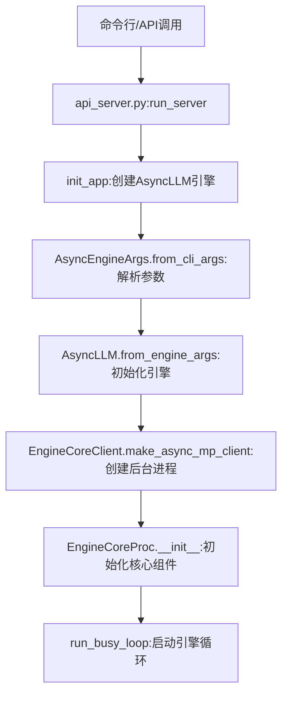
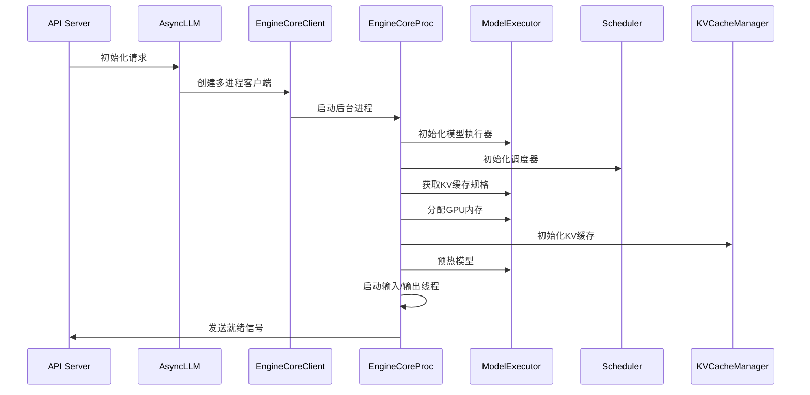
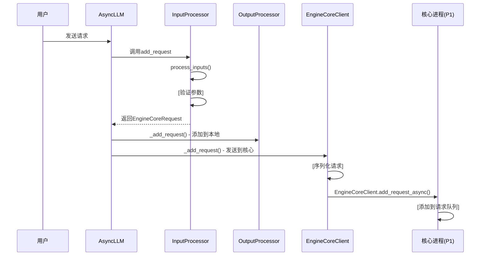
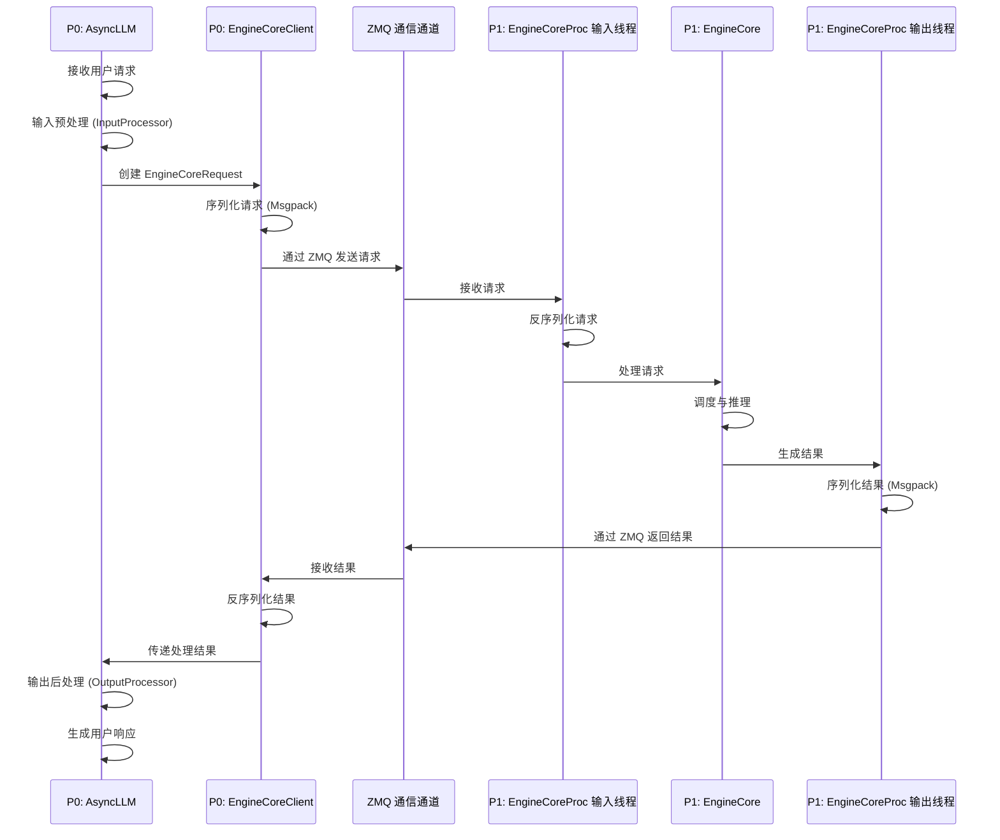
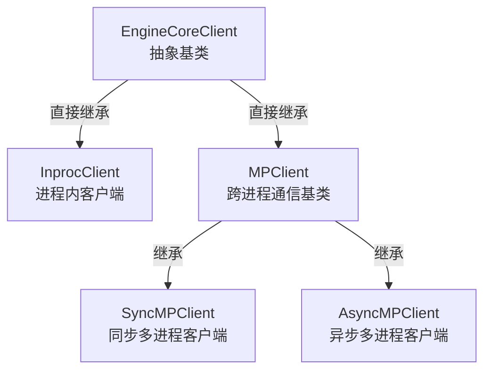
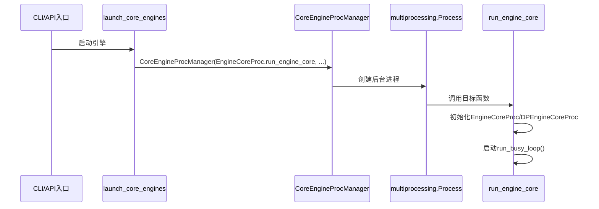
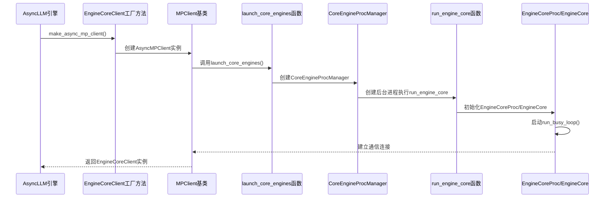
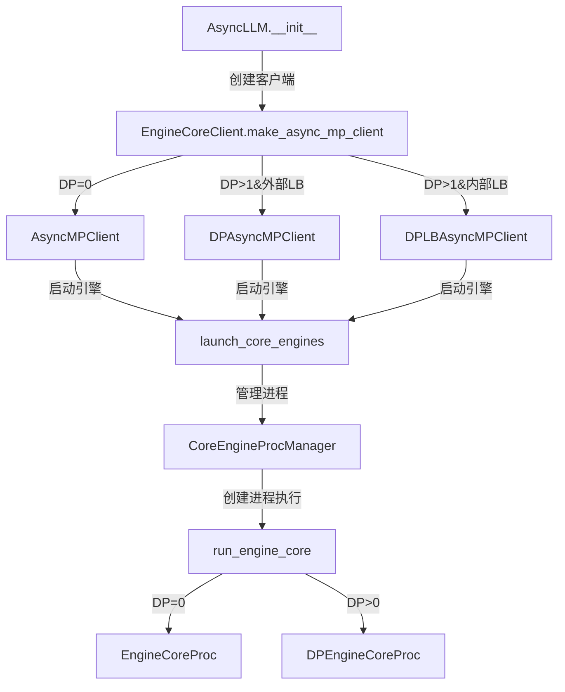

# vLLM 启动过程分析

## 1. 启动入口与初始化链

vLLM的启动过程始于命令行或API调用，主要通过以下路径初始化：



## 1.1 项目核心组件概述

vLLM项目主要由以下核心组件构成，各部分功能如下：

### 1.1.1 入口层（如 `api_server.py`）
- **功能**：处理客户端API请求的入口点，负责启动服务器、初始化引擎和处理HTTP请求。
- **核心函数**：`run_server` - 服务器启动和初始化的主函数。

### 1.1.2 前端引擎层（`AsyncLLM`）
- **功能**：作为用户与系统交互的接口层，负责请求的接收、预处理、结果后处理和响应返回。
- **核心函数**：`generate` - 处理生成请求的入口；`add_request` - 转换请求并发送到核心进程。

### 1.1.3 通信层（`EngineCoreClient`）
- **功能**：实现前端进程（P0）和核心进程（P1）之间的通信。
- **技术**：使用ZeroMQ (ZMQ) 进行跨进程通信，Msgpack进行数据序列化。

### 1.1.4 核心引擎层（`EngineCore`）
- **功能**：vLLM的核心处理单元，负责请求调度、模型推理、资源管理和结果生成。
- **核心组件**：
  - 调度器：管理请求队列和执行顺序
  - 模型执行器：执行实际的模型推理
  - KV缓存管理器：管理键值缓存以提高性能
- **关键特点**：运行在独立进程（P1）中，专注于高效的模型推理。

### 1.1.5 调度器（`Scheduler`）
- **功能**：管理请求的执行顺序、分配资源和决定哪些请求可以同时运行。
- **核心函数**：`schedule` - 根据优先级和资源限制调度请求。

### 1.1.6 模型执行器（`ModelExecutor`）
- **功能**：负责实际的模型推理计算，执行token生成和采样。
- **核心函数**：`step` - 执行引擎步骤，包括调度和模型推理。

### 1.1.7 KV缓存管理器（`KVCacheManager`）
- **功能**：高效管理注意力机制的键值缓存，包括块分配、前缀缓存和缓存共享。
- **关键技术**：PagedAttention算法，实现高效的内存管理。

## 2. 核心组件初始化顺序



## 3. 详细启动步骤

### 3.1 参数解析与环境准备
- **文件位置**：`vllm/entrypoints/api_server.py`
- **核心函数**：`run_server` (第125-151行) 和 `__main__` (第154-184行)
- **关键步骤**：
  ```python
  async def run_server(args: Namespace, llm_engine: AsyncLLMEngine | None = None, **uvicorn_kwargs: Any) -> None:
      # 设置系统资源限制
      set_ulimit()
      # 初始化应用和引擎
      app = await init_app(args, llm_engine)
      # 启动HTTP服务器
      shutdown_task = await serve_http(app, host=args.host, port=args.port, ...)
      await shutdown_task
  ```
  - 解析命令行参数：`AsyncEngineArgs.add_cli_args(parser)` (第182行)
  - 设置系统资源限制：`set_ulimit()` (第131行)
  - 初始化日志系统：`init_logger()` (第34行)

### 3.2 AsyncLLM引擎初始化
- **文件位置**：`vllm/v1/engine/async_llm.py`
- **核心函数**：`AsyncLLM.__init__` (第55-153行)
- **关键步骤**：
  ```python
  def __init__(self, vllm_config: VllmConfig, executor_class: type[Executor], ...) -> None:
      # 注册配置序列化器
      maybe_register_config_serialize_by_value()
      
      # 初始化tokenizer
      if self.model_config.skip_tokenizer_init:
          tokenizer = None
      else:
          tokenizer = cached_tokenizer_from_config(self.model_config)
      
      # 创建输入/输出处理器
      self.input_processor = InputProcessor(self.vllm_config, tokenizer)
      self.output_processor = OutputProcessor(self.tokenizer, ...)
      
      # 创建EngineCoreClient（核心操作）
      self.engine_core = EngineCoreClient.make_async_mp_client(
          vllm_config=vllm_config, executor_class=executor_class, ...
      )
  ```
  - 注册配置序列化器：`maybe_register_config_serialize_by_value()` (第92行)
  - 初始化tokenizer：`cached_tokenizer_from_config()` (第114行)
  - 创建输入处理器：`InputProcessor()` (第116行)
  - 创建输出处理器：`OutputProcessor()` (第123行)
  - **核心操作**：创建EngineCoreClient：`EngineCoreClient.make_async_mp_client()` (第134-141行)

### 3.3 EngineCore进程启动
- **文件位置**：`vllm/v1/engine/core_client.py`和`vllm/v1/engine/core.py`
- **核心函数**：
  - `EngineCoreClient.make_async_mp_client` (第98-121行，core_client.py)
  - `run_engine_core` (第823-874行，core.py)
- **关键步骤**：
  ```python
  def make_async_mp_client(vllm_config: VllmConfig, ...) -> "MPClient":
      parallel_config = vllm_config.parallel_config
      if parallel_config.data_parallel_size > 1:
          if parallel_config.data_parallel_external_lb:
              return DPAsyncMPClient(*client_args)
          return DPLBAsyncMPClient(*client_args)
      return AsyncMPClient(*client_args)
  ```
  - 根据数据并行配置选择客户端类型（第115-121行）
  - 在后台进程中启动EngineCore：`run_engine_core()` (第859行，在进程中执行)

### 3.4 EngineCore核心初始化
- **文件位置**：`vllm/v1/engine/core.py`
- **核心函数**：
  - `EngineCoreProc.__init__` (第589-678行)
  - `EngineCore.__init__` (父类初始化)
- **关键步骤**：
  ```python
  def __init__(self, vllm_config: VllmConfig, ...) -> None:
      # 设置信号处理器
      signal.signal(signal.SIGTERM, signal_handler)
      signal.signal(signal.SIGINT, signal_handler)
      
      # 初始化数据并行环境
      self._init_data_parallel(vllm_config)
      
      # 父类EngineCore初始化
      super().__init__(vllm_config, executor_class, log_stats, executor_fail_callback)
      
      # 创建输入输出线程
      ready_event = threading.Event()
      input_thread = threading.Thread(target=self.process_input_sockets, ...)
      input_thread.start()
      output_thread = threading.Thread(target=self.process_output_sockets, ...)
      output_thread.start()
  ```
  - 设置信号处理器（SIGTERM/SIGINT）：第841-842行
  - 初始化数据并行环境：`_init_data_parallel()` (第635行)
  - **父类EngineCore初始化**：
    - 创建模型执行器：`ModelExecutor`
    - 创建调度器：`Scheduler`
    - 初始化KV缓存：`_initialize_kv_caches()` (第218-264行)
    - 初始化结构化输出管理器：`StructuredOutputManager`
  - 创建输入输出线程：
    - 输入线程：`process_input_sockets()` (第647-657行)
    - 输出线程：`process_output_sockets()` (第659-669行)

### 3.5 就绪状态检查
- **文件位置**：`vllm/v1/engine/core.py`
- **核心函数**：`process_input_sockets` (第991-1065行)
- **关键步骤**：
  ```python
  def process_input_sockets(self, input_addresses: list[str], coord_input_address: str | None, ..., ready_event: threading.Event):
      # 初始化ZMQ输入套接字
      with zmq.Context() as ctx:
          input_sockets = [make_zmq_socket(ctx, input_address, zmq.DEALER, ...) for input_address in input_addresses]
          
          # 等待来自协调器的READY消息
          if coord_socket is not None:
              assert coord_socket.recv() == b"READY"
              poller.register(coord_socket, zmq.POLLIN)
          
          # 设置ready_event，表示引擎已准备就绪
          ready_event.set()
          del ready_event
          
          # 开始处理输入消息
          while True:
              for input_socket, _ in poller.poll():
                  type_frame, *data_frames = input_socket.recv_multipart(copy=False)
                  # 处理请求...
  ```
  - 初始化ZMQ输入套接字：第1005-1012行
  - 等待协调器READY消息：第1039-1040行
  - 设置ready_event：第1042行

## 4. 启动过程关键技术点

### 4.1 多进程架构
- **设计理念**：将计算密集型任务与前端通信分离
- **实现方式**：
  - EngineCore在独立进程中运行，通过ZMQ与前端通信
  - 支持数据并行（DP）模式，通过torch.distributed通信
- **文件位置**：
  - `vllm/v1/engine/core_client.py` - 客户端实现
  - `vllm/v1/engine/core.py` - 核心进程实现

### 4.2 资源管理
- **动态内存分配**：
  - 通过性能分析确定可用GPU内存大小
  - 动态分配KV缓存内存
  - 支持CPU offloading和量化
- **文件位置**：
  - `vllm/v1/engine/core.py` - `_initialize_kv_caches()`方法

### 4.3 并行初始化
- **输入/输出线程**：
  - 独立的输入线程处理客户端请求
  - 独立的输出线程返回结果
  - 与GPU计算重叠，提高效率
- **模型预热**：
  - 在启动时预热模型，减少首次请求延迟
  - 加载必要的计算图和权重

## 5. 启动过程中的进程模型

### 5.1 process0 (P0) - 前端进程
- **主要职责**：
  - 处理客户端API请求
  - 管理tokenizer和输入预处理
  - 协调与EngineCore的通信
- **核心组件**：
  - AsyncLLM引擎接口
  - EngineCoreClient通信层
  - InputProcessor和OutputProcessor
- **文件位置**：
  - `vllm/v1/engine/async_llm.py`

### 5.2 process1 (P1) - 核心进程
- **主要职责**：
  - 执行模型推理计算
  - 管理KV缓存
  - 调度请求执行
- **核心组件**：
  - EngineCore核心引擎
  - Scheduler调度器
  - ModelExecutor模型执行器
- **文件位置**：
  - `vllm/v1/engine/core.py`

### 5.3 核心组件与进程关系

#### 5.3.1 EngineCore与EngineCoreProc的关系
`EngineCore`和`EngineCoreProc`是**继承关系**，且各司其职：

| 类名 | 角色 | 所在进程 | 文件位置 |
|------|------|----------|----------|
| `EngineCore` | 核心引擎基类，定义核心功能接口与实现 | P1（核心进程） | `vllm/v1/engine/core.py` |
| `EngineCoreProc` | `EngineCore`的子类，负责**进程级初始化**与**输入/输出线程管理** | P1（核心进程） | `vllm/v1/engine/core.py` |

**具体实现**：
```python
class EngineCoreProc(EngineCore):
    def __init__(self, vllm_config: VllmConfig, ...) -> None:
        # 1. 设置信号处理器（进程级）
        signal.signal(signal.SIGTERM, signal_handler)
        signal.signal(signal.SIGINT, signal_handler)
        
        # 2. 初始化数据并行环境（进程级）
        self._init_data_parallel(vllm_config)
        
        # 3. 调用父类EngineCore初始化（核心功能）
        super().__init__(vllm_config, ...)
        
        # 4. 创建输入/输出线程（进程间通信）
        input_thread = threading.Thread(target=self.process_input_sockets, ...)
        output_thread = threading.Thread(target=self.process_output_sockets, ...)
```

**职责划分**：
- `EngineCore`：专注于**核心推理功能**（调度器、模型执行器、KV缓存管理）
- `EngineCoreProc`：专注于**进程级管理**（信号处理、数据并行初始化、输入/输出线程）

#### 5.3.2 EngineCoreClient的角色与作用
`EngineCoreClient`之所以叫这个名字，是因为它扮演着**EngineCore的客户端(Client)**角色，负责与运行在独立进程（P1）中的`EngineCore`进行通信。

**主要职责**：
- **请求发送**：将前端处理后的`EngineCoreRequest`序列化后发送给EngineCore
- **结果接收**：接收EngineCore返回的推理结果并反序列化
- **通信管理**：维护与EngineCore之间的通信通道（使用ZeroMQ）

**实现细节**：
- **通信协议**：使用ZeroMQ的DEALER-ROUTER模式发送请求，PUSH-PULL模式接收结果
- **数据序列化**：使用Msgpack进行高效的二进制序列化
- **进程间通信**：跨越前端进程（P0）和核心进程（P1）的边界

**代码中的体现**：
```python
# vllm/v1/engine/async_llm.py: AsyncLLM.__init__
self.engine_core = EngineCoreClient.make_async_mp_client(
    vllm_config=vllm_config, 
    executor_class=executor_class, 
    ...
)

# 通过EngineCoreClient发送请求
await self.engine_core.add_request_async(request)
```

#### 5.3.3 InputProcessor与OutputProcessor的作用

**InputProcessor**：
- **主要职责**：管理输入预处理流程，验证请求参数，处理多模态输入
- **核心功能**：
  - 验证请求参数（logprobs、allowed_token_ids、logit_bias等）
  - 处理多模态输入数据（图像、视频等）
  - 与Tokenizer交互进行输入转换
  - 管理多模态处理器缓存

**OutputProcessor**：
- **主要职责**：处理EngineCore返回的输出，管理请求状态，支持流式输出
- **核心功能**：
  - 处理模型生成的token序列
  - 支持流式输出和批量输出
  - 管理请求生命周期状态
  - 处理请求中止
  - 将模型输出转换为用户友好的格式

**代码中的体现**：
```python
# vllm/v1/engine/async_llm.py: AsyncLLM.__init__
# 初始化输入处理器
self.input_processor = InputProcessor(self.vllm_config, tokenizer)
# 初始化输出处理器
self.output_processor = OutputProcessor(self.tokenizer, ...)
```

### 5.4 前端引擎层与请求管理

#### 5.4.1 为什么需要前端引擎层？

前端引擎层（以`AsyncLLM`为核心）的存在是vLLM架构设计的关键，主要有以下几个原因：

**前后端分离的设计优势**：
- **职责分离**：
  - 前端（P0）：专注于用户交互、输入/输出处理、请求管理
  - 核心（P1）：专注于高性能模型推理、资源管理、调度
- **稳定性保障**：核心推理进程（P1）不受前端交互影响，降低崩溃风险
- **可扩展性**：前端可以灵活支持多种API接口（如OpenAI兼容、自定义API等），核心保持不变

**前端引擎层的具体职责**：
- **用户接口抽象**：提供统一的`AsyncLLM`接口，隐藏底层复杂实现
- **请求生命周期管理**：从接收请求到返回响应的全流程控制
- **输入预处理**：通过`InputProcessor`验证和转换用户请求
- **输出后处理**：通过`OutputProcessor`格式化和分发结果
- **多进程通信**：通过`EngineCoreClient`与核心进程（P1）通信
- **并发控制**：支持大量并发请求的管理和调度
- **流式输出支持**：实现实时生成结果的流式返回

#### 5.4.2 `add_request` 是添加到哪儿了？

从代码实现来看，`add_request`方法将请求添加到了两个不同的地方：

```python
async def _add_request(
    self,
    request: EngineCoreRequest,
    prompt: str | None,
    parent_req: ParentRequest | None,
    index: int,
    queue: RequestOutputCollector,
):
    # 1. 添加到本地 OutputProcessor（P0中）
    self.output_processor.add_request(request, prompt, parent_req, index, queue)

    # 2. 通过 EngineCoreClient 发送到核心进程（P1中）
    await self.engine_core.add_request_async(request)

    if self.log_requests:
        logger.info("Added request %s.", request.request_id)
```

**添加位置与作用**：
1. **本地 OutputProcessor（P0中）**：
   - 作用：管理请求的输出状态、支持流式输出、处理请求中止
   - 实现：在`OutputProcessor`中维护请求状态字典

2. **核心进程 EngineCore（P1中）**：
   - 作用：实际执行模型推理、资源分配、请求调度
   - 实现：通过`EngineCoreClient`的跨进程通信机制发送请求

**完整的请求添加流程**：



## 6. P0与P1之间的通信机制

### 6.1 通信协议
- **使用技术**：ZMQ（ZeroMQ）通信库
- **通信模式**：
  - 前端（P0）通过DEALER-ROUTER模式发送请求
  - 核心（P1）通过PUSH-PULL模式返回结果
- **文件位置**：
  - `vllm/v1/engine/core.py` - `process_input_sockets()`和`process_output_sockets()`方法

### 6.2 详细通信流程



**详细步骤**：
1. **P0 中**：
   - `AsyncLLM` 接收用户请求
   - `InputProcessor` 进行输入预处理（参数验证、多模态处理等）
   - `AsyncLLM` 创建 `EngineCoreRequest`
   - `EngineCoreClient` 序列化请求（使用Msgpack）
   - 通过 ZMQ 发送请求到 P1

2. **P1 中**：
   - `EngineCoreProc` 的输入线程接收请求
   - 反序列化请求数据
   - `EngineCore` 处理请求（调度、模型推理等）
   - 输出线程序列化结果（使用Msgpack）
   - 通过 ZMQ 返回结果到 P0

3. **P0 中**：
   - `EngineCoreClient` 接收并反序列化结果
   - 传递处理结果给 `AsyncLLM`
   - `OutputProcessor` 进行输出后处理（结果格式化、流式输出等）
   - `AsyncLLM` 生成最终响应返回给用户

### 6.2 数据序列化
- **使用技术**：Msgpack序列化
- **优势**：
  - 高效的二进制序列化
  - 支持复杂数据结构
  - 快速的序列化和反序列化
- **文件位置**：
  - `vllm/v1/engine/core.py` - `MsgpackDecoder`和`MsgpackEncoder`

### 6.3 缓存同步机制
- **设计理念**：
  - P0和P1维护镜像缓存
  - 确保缓存驱逐顺序一致
  - 避免不必要的通信开销
- **实现方式**：
  - P0缓存元数据，P1缓存实际数据
  - 通过哈希同步缓存状态
  - get_and_update()方法确保操作顺序一致
- **文件位置**：
  - `vllm/multimodal/cache.py`

## 7. 启动完成的标志

### 7.1 就绪状态条件
- **所有组件初始化完成**：
  - 模型加载完成
  - KV缓存初始化完成
  - 输入/输出线程启动
- **通信通道建立**：
  - ZMQ套接字初始化完成
  - 与DP Coordinator（如果有）握手成功

### 7.2 健康检查
- **文件位置**：`vllm/entrypoints/api_server.py` - `/health`端点
- **实现**：
  ```python
  @app.get("/health")
  async def health() -> Response:
      """Health check."""
      return Response(status_code=200)
  ```

## 8. 性能优化关键点

### 8.1 启动性能优化
- **模型预热**：减少首次请求延迟
- **内存预分配**：提前分配KV缓存内存
- **并行初始化**：输入/输出线程与GPU计算重叠

### 8.2 资源限制优化
- **设置合理的ulimit**：避免文件描述符限制
- **GPU内存分配策略**：平衡模型权重和KV缓存
- **CPU亲和性**：提高CPU-GPU通信效率

## 9. 总结

vLLM的启动过程是一个复杂的多步骤初始化过程，涉及多个组件的协同工作。通过将前端进程（P0）和核心进程（P1）分离，vLLM实现了高效的资源管理和并行处理能力。P0负责客户端通信和请求预处理，P1负责实际的模型推理计算，它们之间通过ZMQ通信保持同步。这种设计使得vLLM能够高效地处理大规模模型推理请求，同时保持低延迟和高吞吐量。

## 10. EngineCoreClient 继承关系与功能分析

### 10.1 继承关系图



### 10.2 核心类解析

#### 10.2.1 EngineCoreClient（抽象基类）

**定义位置**：`vllm/v1/engine/core_client.py:61`

**核心功能**：
- 定义客户端与引擎核心通信的抽象接口
- 提供客户端创建工厂方法 `make_client()`
- 支持不同通信模式（进程内、同步多进程、异步多进程）

**关键方法**：
- `add_request()`: 添加请求到引擎核心
- `get_output()`: 获取引擎输出
- `abort_requests()`: 中止请求
- `call_utility()`: 调用引擎工具方法

#### 10.2.2 InprocClient（进程内客户端）

**定义位置**：`vllm/v1/engine/core_client.py:257`

**核心功能**：
- 在同一进程内直接与 `EngineCore` 交互
- 无网络通信开销，适用于单进程场景

**实现特点**：
- 内部持有 `EngineCore` 实例
- 直接调用 `EngineCore` 方法，无序列化/反序列化开销
- 用于 V0 风格的 `LLMEngine`

**关键方法**：
```python
def __init__(self, *args, **kwargs):
    self.engine_core = EngineCore(*args, **kwargs)

def add_request(self, request: EngineCoreRequest) -> None:
    req, request_wave = self.engine_core.preprocess_add_request(request)
    self.engine_core.add_request(req, request_wave)
```

#### 10.2.3 MPClient（跨进程通信基类）

**核心功能**：
- 提供跨进程通信的基础实现
- 基于 ZeroMQ (ZMQ) 实现高效的进程间通信
- 使用 Msgpack 进行数据序列化/反序列化

**实现特点**：
- 管理 ZMQ 套接字（输入/输出）
- 处理消息编码/解码
- 支持多进程和分布式场景

#### 10.2.4 SyncMPClient（同步多进程客户端）

**定义位置**：`vllm/v1/engine/core_client.py:642`

**核心功能**：
- 提供同步的跨进程通信接口
- 适用于需要阻塞等待结果的场景

**实现特点**：
- 继承自 `MPClient`
- 使用线程处理异步通信，对外提供同步接口
- 适用于非异步代码环境

#### 10.2.5 AsyncMPClient（异步多进程客户端）

**定义位置**：`vllm/v1/engine/core_client.py:808`

**核心功能**：
- 提供异步的跨进程通信接口
- 适用于高并发、异步代码环境

**实现特点**：
- 继承自 `MPClient`
- 基于 `asyncio` 实现异步通信
- 使用异步队列管理输出
- 支持并行处理多个请求

**关键方法**：
```python
async def get_output_async(self) -> EngineCoreOutputs:
    self._ensure_output_queue_task()
    outputs = await self.outputs_queue.get()
    if isinstance(outputs, Exception):
        raise self._format_exception(outputs) from None
    return outputs

async def add_request_async(self, request: EngineCoreRequest) -> None:
    request.client_index = self.client_index
    await self._send_input(EngineCoreRequestType.ADD, request)
    self._ensure_output_queue_task()
```

### 10.3 各客户端类的应用场景

| 客户端类 | 应用场景 | 优点 | 缺点 |
|----------|----------|------|------|
| InprocClient | 单进程环境、调试、测试 | 无通信开销、简单直接 | 无法利用多进程优势 |
| SyncMPClient | 同步代码环境、兼容性要求高 | 接口简单、易集成 | 阻塞等待降低并发 |
| AsyncMPClient | 高并发异步环境、生产环境 | 高性能、非阻塞 | 需要异步代码支持 |

### 10.4 客户端创建机制

`EngineCoreClient` 提供工厂方法 `make_client()` 根据配置创建不同类型的客户端：

```python
@staticmethod
def make_client(
    multiprocess_mode: bool,
    asyncio_mode: bool,
    vllm_config: VllmConfig,
    executor_class: type[Executor],
    log_stats: bool,
) -> "EngineCoreClient":
    if asyncio_mode and not multiprocess_mode:
        raise NotImplementedError(
            "Running EngineCore in asyncio without multiprocessing "
            "is not currently supported."
        )

    if multiprocess_mode and asyncio_mode:
        return AsyncMPClient(vllm_config, executor_class, log_stats)

    if multiprocess_mode and not asyncio_mode:
        return SyncMPClient(vllm_config, executor_class, log_stats)

    return InprocClient(vllm_config, executor_class, log_stats)
```

### 10.5 同步与异步客户端的选择

#### 10.5.1 OpenAI API的选择

**结论**：OpenAI API服务器使用的是**异步客户端**。

**代码证据**：
```python
# vllm/entrypoints/openai/api_server.py:146-178
async def build_async_engine_client(
    args: Namespace,
    *,  # 关键字参数
    usage_context: UsageContext = UsageContext.OPENAI_API_SERVER,
    disable_frontend_multiprocessing: bool | None = None,
    client_config: dict[str, Any] | None = None,
) -> AsyncIterator[EngineClient]:
    # ...
    async with build_async_engine_client_from_engine_args(
        engine_args,
        usage_context=usage_context,
        disable_frontend_multiprocessing=disable_frontend_multiprocessing,
        client_config=client_config,
    ) as engine:
        yield engine

# 使用AsyncLLM创建客户端
async_llm = AsyncLLM.from_vllm_config(
    vllm_config=vllm_config,
    usage_context=usage_context,
    # ...
)
```

#### 10.5.2 为什么选择异步客户端？

**高并发性能需求**：
- 异步IO允许在等待IO操作时处理其他请求
- 减少资源消耗，避免为每个请求创建独立线程
- 提高吞吐量，处理更多并发请求

**流式输出支持**：
- OpenAI API支持流式输出（`stream=true`）
- 异步生成器（`AsyncGenerator`）天然适合实现流式响应
- 一边生成结果一边返回给客户端，提升用户体验

**框架兼容性**：
- FastAPI是异步框架，与异步客户端无缝集成
- 更好地利用FastAPI的并发特性

## 11. run_engine_core 函数分析

### 11.1 函数定义与作用

**定义位置**：`vllm/v1/engine/core.py:823`

**核心功能**：
- 在后台进程中启动 EngineCore 的繁忙循环
- 处理信号中断（SIGTERM/SIGINT）实现优雅关闭
- 根据数据并行配置选择合适的 EngineCore 实现（普通或分布式）

**关键实现**：
```python
def run_engine_core(*args, dp_rank: int = 0, local_dp_rank: int = 0, **kwargs):
    # 设置信号处理器
    def signal_handler(signum, frame):
        nonlocal shutdown_requested
        if not shutdown_requested:
            shutdown_requested = True
            raise SystemExit()
    
    signal.signal(signal.SIGTERM, signal_handler)
    signal.signal(signal.SIGINT, signal_handler)
    
    # 根据并行配置创建 EngineCore 实例
    try:
        parallel_config: ParallelConfig = kwargs["vllm_config"].parallel_config
        if parallel_config.data_parallel_size > 1 or dp_rank > 0:
            # 分布式数据并行场景
            engine_core = DPEngineCoreProc(*args, **kwargs)
        else:
            # 单进程场景
            engine_core = EngineCoreProc(*args, **kwargs)
        
        # 启动繁忙循环
        engine_core.run_busy_loop()
    except SystemExit:
        logger.debug("EngineCore exiting.")
```

### 11.2 调用链分析

#### 11.2.1 主要调用入口

`run_engine_core` 主要通过 `CoreEngineProcManager` 类被调用，该类负责管理 EngineCore 进程的创建和启动。



#### 11.2.2 详细调用路径

**本地引擎启动**：

```python
# vllm/v1/engine/utils.py:885-896
local_engine_manager = CoreEngineProcManager(
    EngineCoreProc.run_engine_core,  # 传入run_engine_core作为目标函数
    vllm_config=vllm_config,
    executor_class=executor_class,
    log_stats=log_stats,
    handshake_address=handshake_address,
    client_handshake_address=client_handshake_address,
    local_client=True,
    local_engine_count=local_engine_count,
    start_index=dp_rank,
    local_start_index=local_start_index or 0,
)
```

**进程创建与启动**：

```python
# vllm/v1/engine/utils.py:120-130
self.processes.append(
    context.Process(
        target=target_fn,  # 这里target_fn就是run_engine_core
        name=f"EngineCore_DP{global_index}",
        kwargs=common_kwargs
        | {
            "dp_rank": global_index,
            "local_dp_rank": local_index,
        },
    )
)

# 启动所有进程
for proc, local_dp_rank in zip(self.processes, local_dp_ranks):
    proc.start()
```

### 11.3 并行配置处理

`run_engine_core` 根据并行配置选择不同的 EngineCore 实现：

| 场景 | EngineCore 实现 | 说明 |
|------|----------------|------|
| 单进程 | `EngineCoreProc` | 标准引擎核心实现 |
| 多进程数据并行 | `DPEngineCoreProc` | 分布式数据并行实现 |

**关键判断逻辑**：
```python
parallel_config = kwargs["vllm_config"].parallel_config
if parallel_config.data_parallel_size > 1 or dp_rank > 0:
    # 分布式场景
    engine_core = DPEngineCoreProc(*args, **kwargs)
else:
    # 单进程场景
    engine_core = EngineCoreProc(*args, **kwargs)
```

### 11.4 信号处理与优雅关闭

`run_engine_core` 实现了信号处理机制，确保引擎可以优雅关闭：

1. 设置 `SIGTERM` 和 `SIGINT` 信号处理器
2. 当收到信号时，设置 `shutdown_requested` 标志并抛出 `SystemExit`
3. 这允许引擎完成当前任务后正常退出

## 12. EngineCoreClient与EngineCore自动启动机制

### 12.1 启动流程概述

EngineCoreClient和EngineCore的启动是一个**自动联动**的过程，主要通过以下几个关键步骤完成：



### 12.2 关键启动函数详解

#### 12.2.1 EngineCoreClient.make_async_mp_client()

**位置**：`vllm/v1/engine/core_client.py:98-121`

**作用**：工厂方法，根据配置创建合适的EngineCoreClient实例：

```python
@staticmethod
def make_async_mp_client(vllm_config: VllmConfig, ...) -> "MPClient":
    parallel_config = vllm_config.parallel_config
    if parallel_config.data_parallel_size > 1:
        if parallel_config.data_parallel_external_lb:
            return DPAsyncMPClient(*client_args)
        return DPLBAsyncMPClient(*client_args)
    return AsyncMPClient(*client_args)
```

#### 12.2.2 MPClient.__init__()

**位置**：`vllm/v1/engine/core_client.py:442-553`

**关键步骤**：
1. 初始化ZMQ上下文和序列化器
2. **调用`launch_core_engines()`启动EngineCore进程**（第477行）
3. 建立ZMQ输入/输出套接字
4. 等待EngineCore进程的就绪消息

```python
def __init__(self, asyncio_mode: bool, vllm_config: VllmConfig, ...):
    # ...初始化序列化器和ZMQ上下文...
    
    # 关键：启动EngineCore进程
    if not client_addresses:
        # Engines are managed by this client.
        with launch_core_engines(vllm_config, executor_class, log_stats) as (
            engine_manager,
            coordinator,
            addresses,
        ):
            self.resources.coordinator = coordinator
            self.resources.engine_manager = engine_manager
    
    # ...建立通信套接字...
    
    # 等待EngineCore就绪
    while identities:
        identity, _ = sync_input_socket.recv_multipart()
        identities.remove(identity)
```

#### 12.2.3 launch_core_engines()

**位置**：`vllm/v1/engine/utils.py:759-898`

**核心功能**：根据并行配置启动EngineCore进程和协调器：

```python
def launch_core_engines(vllm_config: VllmConfig, ...) -> Iterator[...]:
    # ...配置处理...
    
    # 关键：创建CoreEngineProcManager管理EngineCore进程
    if local_engine_count:
        local_engine_manager = CoreEngineProcManager(
            EngineCoreProc.run_engine_core,  # 目标函数
            vllm_config=vllm_config,
            executor_class=executor_class,
            log_stats=log_stats,
            # ...其他参数...
        )
    
    # ...返回引擎管理器和地址信息...
```

### 12.3 自动启动机制的优势

1. **简化使用**：用户只需创建EngineCoreClient实例，无需手动启动EngineCore
2. **紧密集成**：客户端和引擎的启动过程无缝衔接
3. **配置驱动**：根据并行配置自动调整启动方式
4. **鲁棒性**：包含完整的错误处理和超时机制
5. **扩展性**：支持多种并行模式和通信方式

### 12.4 通信建立过程

1. **EngineCoreClient** 初始化ZMQ输入/输出套接字
2. **EngineCore** 启动后初始化自己的ZMQ套接字
3. **EngineCore** 向 **EngineCoreClient** 发送就绪消息
4. **EngineCoreClient** 收到就绪消息后完成初始化
5. 双方建立稳定的ZMQ通信通道

## 13. 数据并行(DP)启用/禁用对比与初始化分离分析

### 13.1 核心对比表格

| 对比维度 | 禁用DP | 启用DP |
|----------|--------|--------|
| **进程结构** | 1个EngineCore进程 | 多个EngineCore进程（1个/DP rank） |
| **引擎类型** | `EngineCoreProc` | `DPEngineCoreProc` |
| **协调器** | 无 | 有`DPCoordinator`进程 |
| **GPU数量** | 1个 | 多个（1个/DP rank） |
| **通信架构** | 简单（前端↔EngineCore） | 复杂（前端↔多个EngineCore+EngineCore间通信） |
| **内存分配** | 单GPU内存限制 | 分布式内存（总内存=单GPU×DP数） |
| **计算分布** | 单GPU计算 | 分布式计算 |
| **启动时间** | 较短 | 较长（需分布式初始化） |
| **适用场景** | 小模型、低并发、调试 | 大模型、高并发、生产环境 |
| **复杂度** | 低 | 高（分布式协调+跨进程通信） |
| **吞吐量潜力** | 受单GPU限制 | 可线性扩展（受通信开销影响） |

### 13.2 DP初始化分离的实际起始层级

**修正结论**：DP初始化分离实际上在**客户端创建阶段**就已经开始，比之前分析的更早。

#### 13.2.1 客户端层面的分离（最早起点）

**关键位置**：`vllm/v1/engine/core_client.py:106-121`（`make_async_mp_client`方法）

**代码证据**：
```python
@staticmethod
def make_async_mp_client(vllm_config: VllmConfig, ...) -> "MPClient":
    parallel_config = vllm_config.parallel_config
    client_args = (...)  # 参数准备
    
    # 根据DP配置选择不同的客户端类
    if parallel_config.data_parallel_size > 1:
        if parallel_config.data_parallel_external_lb:
            return DPAsyncMPClient(*client_args)  # 外部负载均衡DP客户端
        return DPLBAsyncMPClient(*client_args)  # 内部负载均衡DP客户端
    return AsyncMPClient(*client_args)  # 普通客户端
```

#### 13.2.2 引擎层面的分离

**关键位置**：`vllm/v1/engine/core.py:846-857`（`run_engine_core`函数）

**代码证据**：
```python
def run_engine_core(*args, dp_rank: int = 0, local_dp_rank: int = 0, **kwargs):
    parallel_config: ParallelConfig = kwargs["vllm_config"].parallel_config
    
    # 根据DP配置选择不同的引擎类
    if parallel_config.data_parallel_size > 1 or dp_rank > 0:
        engine_core = DPEngineCoreProc(*args, **kwargs)  # 分布式引擎
    else:
        engine_core = EngineCoreProc(*args, **kwargs)  # 普通引擎
    
    engine_core.run_busy_loop()
```

### 13.3 DP初始化分离的完整调用链



### 13.4 DP初始化分离的两个层次

#### 1. 客户端层面的分离
- **目的**：为不同的DP配置提供专门的客户端实现
- **实现**：选择`AsyncMPClient`、`DPAsyncMPClient`或`DPLBAsyncMPClient`
- **影响**：客户端的通信逻辑、负载均衡策略和协调机制不同

#### 2. 引擎层面的分离
- **目的**：为不同的DP配置提供专门的引擎实现
- **实现**：选择`EngineCoreProc`或`DPEngineCoreProc`
- **影响**：引擎的初始化流程、分布式协调和计算策略不同

### 13.5 关键技术细节

1. **客户端分离的依据**：
   - `parallel_config.data_parallel_size > 1` 决定是否使用DP客户端
   - `parallel_config.data_parallel_external_lb` 决定使用哪种DP客户端

2. **引擎分离的依据**：
   - `parallel_config.data_parallel_size > 1` 或 `dp_rank > 0` 决定是否使用DP引擎
   - `DPEngineCoreProc` 继承自 `EngineCoreProc` 并添加了DP特定功能

3. **DP初始化的关键步骤**：
   - 客户端创建阶段：选择合适的客户端类
   - 引擎启动阶段：选择合适的引擎类
   - 引擎初始化阶段：配置分布式进程组和跨GPU通信

## 14. 总结与最佳实践

### 14.1 核心启动流程回顾

vLLM的启动过程是一个精心设计的自动化流程：

1. **前端初始化**：创建AsyncLLM引擎实例
2. **客户端创建**：通过EngineCoreClient工厂方法创建合适的客户端（DP分离在此开始）
3. **引擎启动**：客户端自动启动EngineCore进程（再次进行DP分离）
4. **通信建立**：通过ZeroMQ建立进程间通信
5. **就绪验证**：等待引擎就绪信号
6. **服务可用**：开始接受和处理用户请求

### 14.2 最佳实践建议

1. **配置合理的并行参数**：根据硬件资源选择合适的数据并行大小
2. **监控启动日志**：关注引擎启动过程中的关键信息和警告
3. **使用健康检查**：定期验证引擎状态确保服务可用性
4. **优雅关闭**：使用SIGTERM信号确保引擎正常关闭
5. **性能优化**：根据实际需求调整KV缓存大小和批处理参数6. **理解DP分离机制**：掌握客户端和引擎两个层面的DP分离，有助于调试和性能优化
